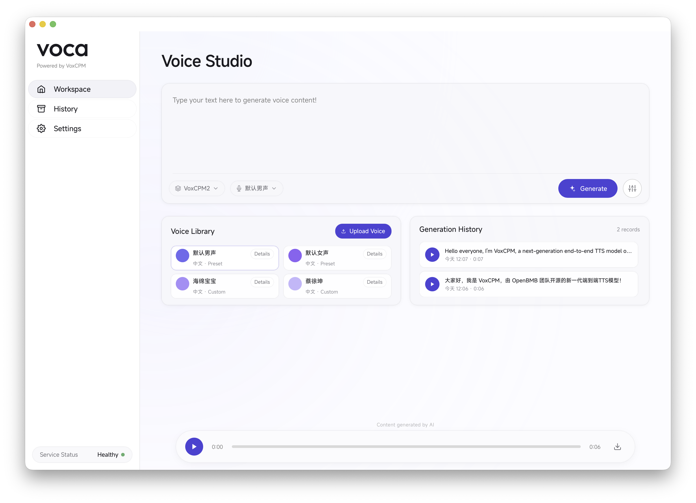
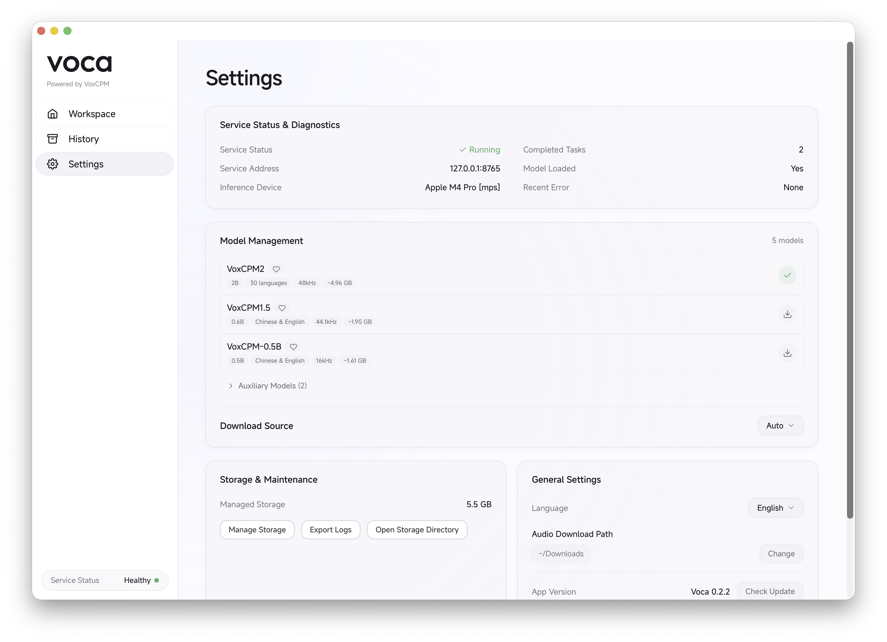

<p align="center">
  <br />
  
  <br /><br />
</p>

<h1 align="center">Voca — Your Local Voice Clone Assistant</h1>

<p align="center">
  English | <a href="README_zh.md">简体中文</a> | <a href="README_zh-TW.md">繁體中文</a>
</p>

<p align="center">
  <a href="https://github.com/ZMXJJ/Voca/releases"></a>
  <a href="https://github.com/ZMXJJ/Voca/stargazers"></a>
  <a href="https://github.com/ZMXJJ/Voca/issues"></a>
  <a href="LICENSE"></a>
</p>

<p align="center">
  A local-first desktop app for voice cloning. Download and use — high-quality speech synthesis and voice cloning run entirely on your machine!
</p>

<p align="center">
  <br />
  <a href="https://github.com/ZMXJJ/Voca/releases/latest">
    
  </a>
</p>

---

## Screenshots

<p align="center">
  
  &nbsp;
  
</p>

## Highlights

- **Fully Offline** — After model download, all inference runs locally with no network required and no privacy concerns
- **Zero Configuration** — First launch automatically handles environment detection, runtime download, model download & warm-up
- **High-Quality Voice Cloning** — Powered by the VoxCPM engine, supporting bilingual (Chinese & English) speech synthesis and voice cloning
- **Fine-Grained Control** — Adjustable CFG guidance scale, inference steps, seed, text normalization, post-processing denoising, and more
- **Extreme Clone Mode** — Uses reference audio transcription to further improve voice fidelity
- **Built-in ASR** — Automatically transcribes reference audio with SenseVoice Small (ONNX Runtime on CPU), with manual editing support
- **Dual Model Sources** — Download models from Hugging Face or ModelScope, with automatic source recommendation
- **Trilingual UI** — Traditional Chinese, Simplified Chinese, and English interface

## Table of Contents

- [Getting Started](#getting-started)
- [Features](#features)
- [Tech Stack](#tech-stack)
- [Roadmap](#roadmap)
- [Contributing](#contributing)
- [Known Limitations](#known-limitations)
- [Acknowledgments](#acknowledgments)
- [License](#license)

## Getting Started

### System Requirements

| Item | macOS | Windows |
|------|-------|---------|
| Version | macOS 14.0 (Sonoma) or later | Windows 10 22H2 / Windows 11 (x86_64) |
| Chip | Apple Silicon (M1/M2/M3/M4) | Intel/AMD x86_64 (NVIDIA GPU optional) |
| Disk Space | ~6 GB (app + models) | ~6 GB CPU build, +2.5 GB if upgrading to CUDA |
| Inference Backend | MPS (Apple Silicon) by default | CPU by default; can be upgraded to CUDA on demand |

### Installation

**macOS**

1. Go to the [Releases](https://github.com/ZMXJJ/Voca/releases) page and download the latest `.dmg` file
2. Open the DMG and drag Voca into the Applications folder
3. On first launch, follow the guided setup to download models and start using the app

**Windows**

1. Go to the [Releases](https://github.com/ZMXJJ/Voca/releases) page and download the latest `Voca-x.y.z-x64-setup.exe`
2. Run the installer (per-user install, no admin rights needed) and launch Voca from the Start menu
3. The CPU build ships with PyTorch CPU. If an NVIDIA GPU is detected, Settings → Inference Backend offers a one-click CUDA upgrade (~2.5 GB download with resumable transfer and automatic rollback on failure)

> **About App Signing & Notarization**
>
> Voca is signed with an Apple Developer ID and has been successfully notarized by Apple, so it is safe to run on macOS.
>
> If you still hit a Gatekeeper warning on first launch (e.g. "Voca" cannot be opened, "Voca is damaged and can't be opened", or "cannot verify the developer"), it's usually because macOS has attached a quarantine attribute to files downloaded via the browser. You can remove the quarantine flag by running the following command in Terminal:
>
> ```bash
> sudo xattr -dr com.apple.quarantine /Applications/Voca.app
> ```
>
> Then reopen Voca. Alternatively, open **System Settings → Privacy & Security** and click **Open Anyway**.

### First Launch

Voca includes a complete onboarding flow:

**Environment Check** → **Runtime Download** → **Model Download & Verification** → **Model Warm-up** → **Ready to Use**

Just follow the on-screen instructions — no manual configuration needed.

## Features

### Speech Generation Workspace

Enter text, select a model and voice, and generate high-quality speech with one click. Supports queued task management for submitting multiple generation requests simultaneously.

Adjustable generation parameters:

| Parameter | Description |
|-----------|-------------|
| CFG Scale | Controls generation guidance strength |
| Inference Steps | Balance between quality and speed |
| Seed | Fix seed for reproducible results, or randomize |
| Text Normalization | Automatically handles numbers, abbreviations, etc. |
| Post-Processing Denoise | Removes background noise after generation |
| Extreme Clone Mode | Uses reference audio transcription to improve voice cloning fidelity |

### Voice Library

Manage preset and custom voices. When creating custom voices, upload reference audio and the built-in SenseVoice ONNX recognizer will automatically transcribe the text, with support for manual editing.

### Generation History

View all task statuses (queued / generating / completed / failed / cancelled). Completed tasks can be played back and exported as audio files.

### Model Management

Built-in model catalog with support for downloading from Hugging Face or ModelScope, with automatic recommendation of the optimal source based on your network. Manage TTS models and auxiliary models (ASR, audio enhancement).

### In-App Update Check

Check for new versions in Settings. When an update is available, the app opens the corresponding Release page for download.

## Tech Stack

| Layer | Technology |
|-------|-----------|
| Desktop Framework | Tauri 2 (Rust) |
| Frontend | React 19 + TypeScript + Vite |
| Inference Service | Python (FastAPI + Uvicorn) sidecar |
| Speech Engine | VoxCPM |
| Runtime | Python 3.11+ |
| Platform | macOS 14.0+ (Apple Silicon) |

## Roadmap

> Upcoming development directions. Priorities may shift based on community feedback.

- [x] **Lighter inference backend** — ASR migrated from PyTorch/FunASR to ONNX Runtime (`iic/SenseVoiceSmall-onnx`, INT8), significantly reducing app size and model download size
- [ ] **Quantized model support** — INT8 and other quantized inference to lower memory and disk usage
- [ ] **Richer TTS capabilities** — Support for more TTS models and expanded speech synthesis features
- [x] Windows support (x86_64, NSIS installer, optional CUDA upgrade)

Have ideas or suggestions? Let us know via [Issues](https://github.com/ZMXJJ/Voca/issues).

## Contributing

> **Note:** Voca is still in its early stages. The engineering experience (build process, developer docs, code structure, etc.) may not be fully polished yet. If you run into any issues while using or developing, we'd love for you to open an Issue or contribute directly — let's make it better together.

Ways to get involved:

- Submit bug reports or feature requests → [Issues](https://github.com/ZMXJJ/Voca/issues)
- Submit code improvements → Pull Request
- Improve documentation or translations

## Known Limitations

- Runs on macOS (Apple Silicon) and Windows x86_64; Linux support is not yet planned
- First launch requires an internet connection to download models (~1–2 GB); fully offline after that
- Voice cloning quality depends heavily on reference audio quality — clean audio with no background noise is recommended

## Acknowledgments

- [VoxCPM](https://github.com/OpenBMB/VoxCPM) — Speech synthesis engine
- [Tauri](https://tauri.app/) — Desktop application framework
- [SenseVoice](https://github.com/FunAudioLLM/SenseVoice) — Speech recognition model
- Model: [Claude Opus 4.6](https://www.anthropic.com/) & [GPT-5.4](https://openai.com/)

## License

This project is licensed under the [Apache License 2.0](LICENSE).

---

<p align="center">
  <a href="https://star-history.com/#ZMXJJ/Voca&Date">
    
  </a>
</p>
