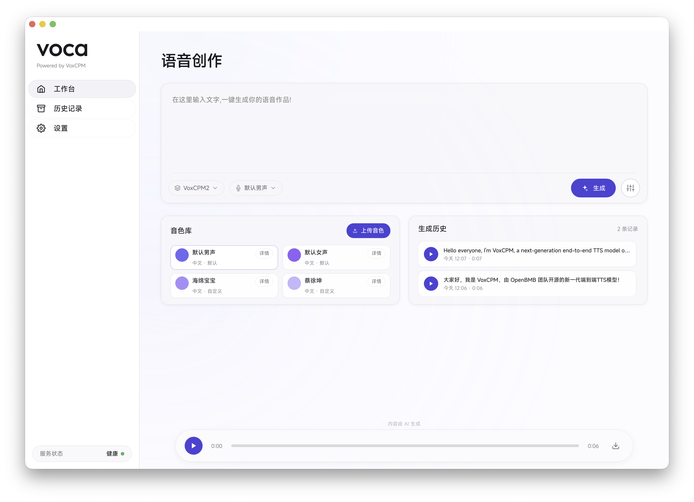
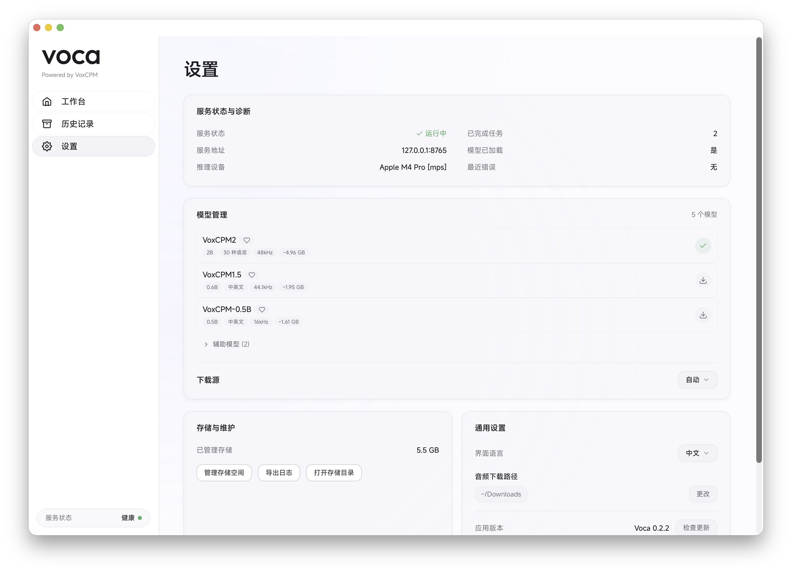

<p align="center">
  <br />
  
  <br /><br />
</p>

<h1 align="center">Voca — 本地语音克隆桌面助手</h1>

<p align="center">
  <a href="README.md">English</a> | 简体中文 | <a href="README_zh-TW.md">繁體中文</a>
</p>

<p align="center">
  <a href="https://github.com/ZMXJJ/Voca/releases"></a>
  <a href="https://github.com/ZMXJJ/Voca/stargazers"></a>
  <a href="https://github.com/ZMXJJ/Voca/issues"></a>
  <a href="LICENSE"></a>
</p>

<p align="center">
  一款运行在本地的语音克隆桌面应用。下载即用，无需联网即可完成高质量语音合成与声音克隆！
</p>

<p align="center">
  <br />
  <a href="https://github.com/ZMXJJ/Voca/releases/latest">
    
  </a>
  &nbsp;&nbsp;
  <a href="https://github.com/ZMXJJ/Voca/releases/latest">
    
  </a>
  <br />
  <sub>Windows 推理仅支持 NVIDIA 显卡</sub>
</p>

---

## 应用截图

<p align="center">
  
  &nbsp;
  
</p>

## Highlights

- **完全离线** — 模型下载完成后，所有推理在本地完成，无需联网，无隐私顾虑
- **开箱即用** — 首次启动自动完成环境检测、运行时下载、模型下载与预热，无需任何手动配置
- **高质量语音克隆** — 基于 VoxCPM 引擎，支持中英双语语音合成与声音克隆
- **精细可控** — CFG 引导强度、推理步数、种子值、文本归一化、后处理降噪等参数均可调节
- **极致克隆模式** — 使用参考音频的转录文本进一步提升声音还原度
- **内置 ASR** — 使用 SenseVoice 小型 ONNX 模型（ONNX Runtime，CPU）将参考音频转录为文本，支持手动编辑校正
- **双源模型下载** — 支持从 Hugging Face 或 ModelScope 下载模型，自动推荐最优源
- **三语界面** — 支持简体中文、繁体中文和英文

## 目录

- [快速开始](#快速开始)
- [功能介绍](#功能介绍)
- [技术栈](#技术栈)
- [Roadmap](#roadmap)
- [Contributing](#contributing)
- [已知限制](#已知限制)
- [致谢](#致谢)
- [许可证](#许可证)

## 快速开始

### 系统要求

| 项目 | macOS | Windows |
|------|-------|---------|
| 版本 | macOS 14.0 (Sonoma) 及以上 | Windows 10 22H2 / Windows 11（x86_64） |
| 芯片 | Apple Silicon (M1/M2/M3/M4) | Intel/AMD x86_64（NVIDIA GPU 可选） |
| 磁盘空间 | 约 4 GB（应用 + 模型） | CPU 版约 6 GB；如升级到 CUDA 再增加约 2.5 GB |
| 推理后端 | Metal（Apple Silicon）— C++ GGUF 引擎，无 PyTorch | 默认 CPU；可在设置中按需升级到 CUDA |

### 安装

**macOS**

1. 前往 [Releases](https://github.com/ZMXJJ/Voca/releases) 页面，下载最新版本的 `.dmg` 文件
2. 打开 DMG，将 Voca 拖入「应用程序」文件夹
3. 首次打开时，按照引导完成模型下载即可开始使用

**Windows**

1. 前往 [Releases](https://github.com/ZMXJJ/Voca/releases) 页面，下载最新的 `Voca-x.y.z-x64-setup.exe`
2. 双击安装包（按用户安装，无需管理员权限），安装完成后从开始菜单启动 Voca
3. 默认发布的是 CPU 版；若检测到 NVIDIA 显卡，可在「设置 → 推理后端」中一键升级到 CUDA（下载约 2.5 GB，支持断点续传，失败会自动回退）

> **关于 App 签名与公证**
>
> Voca 已通过 Apple Developer ID 签名，并已提交 Apple 公证（Notarization）审核通过，可在 macOS 上安全运行。
>
> 如果首次打开时仍然遇到 macOS Gatekeeper 拦截（例如提示「"Voca" 无法打开」「已损坏，无法打开」或「无法验证开发者」），通常是因为系统对从浏览器下载的文件添加了隔离属性（quarantine）。可在终端执行以下命令解除隔离：
>
> ```bash
> sudo xattr -dr com.apple.quarantine /Applications/Voca.app
> ```
>
> 执行后重新打开 Voca 即可。如果仍有问题，也可以在「系统设置 → 隐私与安全性」中点击「仍要打开」来放行。

### 首次启动

Voca 内置了完整的初始化引导流程：

**环境检测** → **运行时下载** → **模型下载与校验** → **模型预热** → **进入工作台**

整个过程只需跟随引导点击即可，无需任何手动配置。

## 功能介绍

### 语音生成工作台

输入文本，选择模型和声音，一键生成高质量语音。支持队列化任务管理，可同时提交多个生成请求。

可调节的生成参数：

| 参数 | 说明 |
|------|------|
| CFG Scale | 控制生成的引导强度 |
| 推理步数 | 平衡生成质量与速度 |
| 种子值 | 固定种子可复现结果，也可随机生成 |
| 文本归一化 | 自动处理数字、缩写等文本规范化 |
| 后处理降噪 | 生成后自动去除背景噪声 |
| 极致克隆模式 | 使用参考音频的转录文本，进一步提升声音克隆的还原度 |

### 声音库

管理预设与自定义声音。创建自定义声音时可上传参考音频，应用内置 SenseVoice ONNX 识别器自动转录参考音频文本，转录结果支持手动编辑校正。

### 生成历史

查看所有生成任务的状态（排队中 / 生成中 / 已完成 / 失败 / 已取消），已完成的任务可直接播放试听并导出音频文件。

### 模型管理

内置模型目录，支持从 Hugging Face 或 ModelScope 下载模型，根据网络环境自动推荐最优下载源。可管理 TTS 主模型及辅助模型（ASR、音频增强）。

### 应用内更新检查

在设置中可检查新版本，有更新时自动跳转到对应 Release 页面下载。

## 技术栈

| 层级 | 技术 |
|------|------|
| 桌面框架 | Tauri 2 (Rust) |
| 前端 | React 19 + TypeScript + Vite |
| 推理服务 | Python (FastAPI + Uvicorn) sidecar |
| 语音引擎 | VoxCPM |
| 运行时 | Python 3.11+ |
| 平台 | macOS 14.0+ (Apple Silicon) |

## Roadmap

> 以下是 Voca 后续的开发方向，优先级可能根据社区反馈调整。

- [x] **更轻量的模型推理后端** — 已将 ASR 从 PyTorch/FunASR 迁移至 ONNX Runtime（`iic/SenseVoiceSmall-onnx`，INT8），大幅减少 App 体积和模型下载大小
- [x] **macOS 无 PyTorch 运行时** — TTS 迁移至 C++ [`llama.cpp-omni`](https://github.com/tc-mb/llama.cpp-omni) GGUF 引擎（常驻 llama-tts-server，Metal），降噪改用 ONNX（sherpa-onnx DPDFNet）；macOS 上彻底移除 PyTorch，App 体积降至约 134 MB
- [ ] **量化模型支持** — 引入 INT8 等量化推理，降低内存占用与磁盘空间需求
- [ ] **更丰富的 TTS 功能** — 支持更多 TTS 模型和更丰富的语音合成能力
- [ ] **Windows 端更轻量的资源占用** — 降低 Windows 端的磁盘与内存占用，优化整体体积
- [x] Windows 平台支持（x86_64，NSIS 安装器，可选 CUDA 升级）

有想法或建议？欢迎通过 [Issues](https://github.com/ZMXJJ/Voca/issues) 告诉我们。

## Contributing

> **注意：** Voca 目前仍处于早期开发阶段，工程化体验（构建流程、开发文档、代码结构等）可能还不够完善。如果你在使用或开发过程中遇到任何问题，非常欢迎提 Issue 或直接参与贡献，一起把它变得更好。

你可以通过以下方式参与：

- 提交 Bug 报告或功能建议 → [Issues](https://github.com/ZMXJJ/Voca/issues)
- 提交代码改进 → Pull Request
- 完善文档或翻译

## 已知限制

- 当前支持 macOS（Apple Silicon）和 Windows x86_64；Linux 暂无支持计划
- 首次启动需联网下载模型（约 1-2 GB），之后可完全离线使用
- 语音克隆效果受参考音频质量影响较大，建议使用清晰、无背景噪声的音频

## 致谢

- [VoxCPM](https://github.com/OpenBMB/VoxCPM) — 语音合成引擎
- [Tauri](https://tauri.app/) — 桌面应用框架
- [SenseVoice](https://github.com/FunAudioLLM/SenseVoice) — 语音识别模型
- Model: [Claude Opus 4.6](https://www.anthropic.com/) & [GPT-5.4](https://openai.com/)

## 许可证

本项目基于 [Apache License 2.0](LICENSE) 开源。

---

<p align="center">
  <a href="https://star-history.com/#ZMXJJ/Voca&Date">
    
  </a>
</p>
