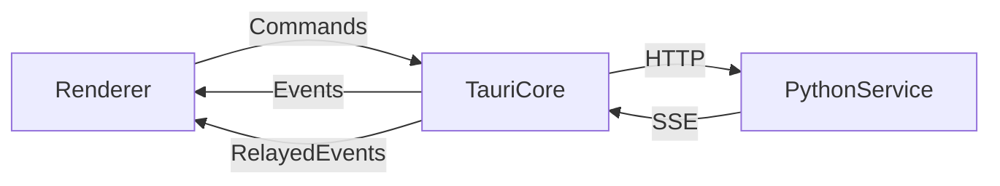

# Voca API / 事件协议文档

## 1. 文档定位

- 文档类型：接口与事件协议
- 对应产品：`Voca`
- 关联文档：
  - [docs/prd_desktop_app_zh.md](docs/prd_desktop_app_zh.md)
  - [docs/tech_solution_voca_zh.md](docs/tech_solution_voca_zh.md)
  - [docs/contracts_draft_voca_zh.md](docs/contracts_draft_voca_zh.md)
  - [docs/p0_poc_implementation_voca_zh.md](docs/p0_poc_implementation_voca_zh.md)
- 适用范围：`P0 PoC` 到 `P1 MVP`

本文档用于定义 `Voca` 的前后端交互边界，包括：

1. 前端 `Renderer` 与 `Tauri Core` 的命令和事件协议
2. `Tauri Core` 与 `Python Service` 的 HTTP / SSE 协议
3. 共享数据结构、任务状态、错误码和下载源模型
4. 前端页面与交互的文字设计说明

## 2. 术语与边界

### 2.1 术语

- `Renderer`
  - 指 `Tauri + React` 的前端渲染层
- `Tauri Core`
  - 指 `src-tauri` 中的 Rust 控制层
- `Python Service`
  - 指本地 Python sidecar，负责 VoxCPM 推理、模型加载和任务执行
- `Provider`
  - 指模型下载平台，如 `Hugging Face`、`魔搭社区`
- `Manifest`
  - 指模型清单文件，用于描述模型版本、文件列表、校验信息与下载源信息

### 2.2 通信边界

`Voca` 采用两层协议：

1. 外部协议：`Renderer <-> Tauri Core`
   - 使用 `Tauri commands + events`
   - 这是前端真正依赖的主协议
2. 内部协议：`Tauri Core <-> Python Service`
   - 使用本地 `HTTP API + SSE`
   - 前端不直接依赖，也不感知具体本地端口

### 2.3 总体原则

1. 前端不直接访问本地模型目录、运行时目录、系统进程和下载源 SDK。
2. 所有高权限操作都由 `Tauri Core` 代理执行。
3. `Python Service` 只负责推理相关能力，不直接负责模型下载平台选择。
4. 所有用户可见错误都必须来自结构化错误码，而不是直接暴露异常堆栈。

## 3. 协议设计原则

### 3.1 一致性

- 命令响应和事件载荷尽量复用同一套共享结构
- 枚举值使用稳定英文常量，前端再映射为中文文案

### 3.2 可恢复性

- 所有长耗时操作都要可查询、可重试、可恢复
- 下载、初始化和生成任务都必须有 `id`、状态和错误信息

### 3.3 可扩展性

- 下载源抽象不绑定单一平台
- 模型版本管理不绑定单一 manifest 结构实现
- 任务类型允许后续扩展到更多生成模式

## 4. 协议总览



说明：

- `Renderer` 通过 `Commands` 发起动作
- `Tauri Core` 负责系统能力、下载、状态持久化、sidecar 生命周期
- `Python Service` 负责模型校验、模型加载、ASR 和语音生成
- Python 的 SSE 事件由 `Tauri Core` 统一转发为前端事件

## 5. 共享数据结构

本节定义跨层共享的数据结构，建议后续沉淀到 `desktop/packages/contracts/`。

### 5.1 通用字段约定

- `id`
  - 使用 `uuid` 字符串
- `ts`
  - 使用 ISO 8601 UTC 时间字符串
- `path`
  - 使用绝对路径
- `bytes`
  - 使用整数，单位为字节
- `durationMs`
  - 使用整数，单位为毫秒

### 5.2 通用响应结构

```json
{
  "success": true,
  "data": {},
  "error": null,
  "requestId": "a5db6867-9cb1-4af0-bb19-47f6048d3201"
}
```

失败时：

```json
{
  "success": false,
  "data": null,
  "error": {
    "code": "MODEL_NOT_FOUND",
    "message": "config.json is missing",
    "userMessageKey": "error.model_not_found",
    "severity": "error",
    "recoverable": true,
    "actions": ["retry", "switch_download_source"],
    "details": {
      "path": "/Users/foo/Library/Application Support/Voca/models/default"
    }
  },
  "requestId": "74fe5d08-6c1c-4f6a-813f-d9518f29617c"
}
```

### 5.3 错误结构

```ts
type ErrorSeverity = "info" | "warning" | "error" | "blocking";

type ErrorAction =
  | "retry"
  | "resume"
  | "switch_download_source"
  | "open_settings"
  | "reinitialize"
  | "export_logs"
  | "check_disk"
  | "contact_support";

type AppError = {
  code: string;
  message?: string;
  userMessageKey: string;
  severity: ErrorSeverity;
  recoverable: boolean;
  actions: ErrorAction[];
  details?: Record<string, unknown>;
};
```

### 5.4 任务结构

```ts
type TaskType =
  | "bootstrap"
  | "generate"
  | "clone"
  | "asr_transcribe"
  | "export_logs"
  | "clear_cache";

type TaskStatus =
  | "queued"
  | "running"
  | "succeeded"
  | "failed"
  | "cancelled";

type TaskRecord = {
  id: string;
  type: TaskType;
  status: TaskStatus;
  createdAt: string;
  updatedAt: string;
  progress?: number;
  message?: string;
  error?: AppError | null;
  result?: Record<string, unknown> | null;
};
```

### 5.5 下载源结构

```ts
type ModelProvider = "huggingface" | "modelscope" | "local";

type ProviderPreference = "auto" | "huggingface" | "modelscope";

type ProviderRecommendationReason =
  | "ip_region_cn"
  | "ip_region_global"
  | "manual_override"
  | "fallback_after_failure"
  | "provider_health";

type ProviderSelection = {
  preferred: ProviderPreference;
  recommended: ModelProvider;
  current: ModelProvider;
  reason: ProviderRecommendationReason;
  userOverridden: boolean;
};
```

### 5.6 Manifest 结构

```ts
type ModelManifest = {
  modelKey: string;
  version: string;
  displayName: string;
  defaultProvider: ModelProvider;
  recommendedRegions: string[];
  providers: {
    huggingface?: {
      repoId: string;
      revision?: string;
      entryPath?: string;
    };
    modelscope?: {
      modelId: string;
      revision?: string;
      entryPath?: string;
    };
  };
  files: Array<{
    path: string;
    sizeBytes?: number;
    checksum?: string;
    required: boolean;
  }>;
};
```

### 5.7 下载任务结构

```ts
type DownloadPhase =
  | "resolving"
  | "downloading"
  | "verifying"
  | "completed"
  | "failed"
  | "paused";

type DownloadJob = {
  jobId: string;
  modelKey: string;
  provider: ModelProvider;
  phase: DownloadPhase;
  bytesReceived: number;
  bytesTotal: number | null;
  speedBytesPerSec?: number | null;
  etaSeconds?: number | null;
  checkpoint?: string | null;
  currentFile?: string | null;
  error?: AppError | null;
};
```

### 5.8 生成参数结构

该结构来自当前 `VoxCPM` 推理能力与 `app.py` 中的参数拼装逻辑。

```ts
type GenerationMode =
  | "quick_tts"
  | "voice_design"
  | "controllable_clone"
  | "ultimate_clone";

type GenerationParams = {
  mode: GenerationMode;
  targetText: string;
  controlInstruction?: string;
  referenceAudioPath?: string;
  promptText?: string;
  cfgValue?: number;
  inferenceTimesteps?: number;
  normalize?: boolean;
  denoise?: boolean;
  streaming?: boolean;
  minLen?: number;
  maxLen?: number;
};
```

说明：

- `quick_tts`
  - 只包含 `targetText`
- `voice_design`
  - 使用 `controlInstruction + targetText`
- `controllable_clone`
  - 使用 `referenceAudioPath + targetText`
- `ultimate_clone`
  - 使用 `referenceAudioPath + promptText + targetText`

### 5.9 设备能力结构

```ts
type DeviceCapabilities = {
  platform: "macos";
  arch: "arm64" | "unknown";
  memoryBytes?: number;
  freeDiskBytes?: number;
  networkReachable: boolean;
  pythonRuntimeInstalled: boolean;
  modelReady: boolean;
  supported: boolean;
  unsupportedReasons: string[];
};
```

### 5.10 初始化状态结构

```ts
type BootstrapPhase =
  | "welcome"
  | "env_check"
  | "runtime_download"
  | "model_download"
  | "asset_verify"
  | "warmup"
  | "ready"
  | "failed";

type BootstrapState = {
  isFirstLaunch: boolean;
  phase: BootstrapPhase;
  status: "idle" | "running" | "paused" | "failed" | "ready";
  runtimeReady: boolean;
  modelReady: boolean;
  sidecarReady: boolean;
  currentDownloadJobId?: string | null;
  lastError?: AppError | null;
};
```

## 6. Renderer 与 Tauri Core 协议

本节是前端真正依赖的外部协议。

### 6.1 Command 设计原则

1. 所有 command 都是幂等优先。
2. 长耗时 command 只负责“发起任务”，进度通过 event 返回。
3. 所有 command 响应都使用统一 `success / data / error / requestId` 结构。

### 6.2 初始化与环境 Command

#### `get_bootstrap_state`

用途：

- 获取当前初始化状态
- 支持 App 重启后的恢复展示

响应 `data`：

```json
{
  "isFirstLaunch": true,
  "phase": "runtime_download",
  "status": "running",
  "runtimeReady": false,
  "modelReady": false,
  "sidecarReady": false,
  "currentDownloadJobId": "job_runtime_001",
  "lastError": null
}
```

#### `get_device_capabilities`

用途：

- 获取设备、磁盘、网络和支持情况

响应 `data`：

```json
{
  "platform": "macos",
  "arch": "arm64",
  "memoryBytes": 17179869184,
  "freeDiskBytes": 197568495616,
  "networkReachable": true,
  "pythonRuntimeInstalled": false,
  "modelReady": false,
  "supported": true,
  "unsupportedReasons": []
}
```

#### `start_bootstrap`

请求 `data`：

```json
{
  "modelKey": "voxcpm2-default",
  "providerPreference": "auto",
  "autoStartSidecar": true
}
```

用途：

- 启动初始化流程
- 自动执行运行时准备、模型下载、校验和 warmup

响应 `data`：

```json
{
  "taskId": "bootstrap_001",
  "phase": "env_check",
  "status": "running"
}
```

#### `retry_bootstrap_step`

请求 `data`：

```json
{
  "phase": "model_download"
}
```

用途：

- 对失败阶段执行重试

### 6.3 生成与任务 Command

#### `create_generate_task`

请求 `data`：

```json
{
  "mode": "voice_design",
  "targetText": "欢迎使用 Voca。",
  "controlInstruction": "温柔、自然、偏年轻女性",
  "cfgValue": 2.0,
  "inferenceTimesteps": 10,
  "normalize": true,
  "denoise": true,
  "streaming": false
}
```

响应 `data`：

```json
{
  "taskId": "task_gen_001",
  "status": "queued"
}
```

#### `create_clone_task`

请求 `data`：

```json
{
  "mode": "controllable_clone",
  "targetText": "这是克隆后的示例文本。",
  "referenceAudioPath": "/Users/foo/Desktop/ref.wav",
  "cfgValue": 2.0,
  "inferenceTimesteps": 10,
  "normalize": true,
  "denoise": true,
  "streaming": false
}
```

若是极致克隆：

```json
{
  "mode": "ultimate_clone",
  "targetText": "这是极致克隆后的示例文本。",
  "referenceAudioPath": "/Users/foo/Desktop/ref.wav",
  "promptText": "这是参考音频中说的话。",
  "cfgValue": 2.0,
  "inferenceTimesteps": 10,
  "normalize": true,
  "denoise": true,
  "streaming": false
}
```

#### `get_task`

请求 `data`：

```json
{
  "taskId": "task_gen_001"
}
```

响应 `data`：

```json
{
  "id": "task_gen_001",
  "type": "generate",
  "status": "succeeded",
  "createdAt": "2026-04-11T10:00:00Z",
  "updatedAt": "2026-04-11T10:00:12Z",
  "progress": 100,
  "result": {
    "audioPath": "/Users/foo/Library/Application Support/Voca/exports/result_001.wav",
    "sampleRate": 24000,
    "durationMs": 5500
  },
  "error": null
}
```

#### `cancel_task`

请求 `data`：

```json
{
  "taskId": "task_gen_001"
}
```

说明：

- `P0` 可先不实现
- `P1` 建议保留协议位

### 6.4 下载与模型 Command

#### `get_download_jobs`

返回当前和历史下载任务列表。

#### `set_download_provider_preference`

请求 `data`：

```json
{
  "preferred": "modelscope"
}
```

说明：

- `auto` 表示按 IP 或可达性默认选择
- `huggingface` 和 `modelscope` 表示用户强制指定

#### `retry_download`

请求 `data`：

```json
{
  "jobId": "job_model_001"
}
```

#### `cancel_download`

请求 `data`：

```json
{
  "jobId": "job_model_001"
}
```

#### `validate_local_model_dir`

请求 `data`：

```json
{
  "path": "/Users/foo/Downloads/VoxCPM2"
}
```

用途：

- 用户手动导入本地模型目录时校验目录是否可用

### 6.5 文件与导出 Command

#### `pick_reference_audio`

用途：

- 打开文件选择器
- 返回用户选择的参考音频路径

#### `choose_export_audio_path`

用途：

- 打开保存路径选择器

#### `export_logs`

用途：

- 导出日志包

响应 `data`：

```json
{
  "taskId": "log_export_001",
  "status": "queued"
}
```

### 6.6 设置与维护 Command

#### `get_settings`

返回：

```json
{
  "downloadProviderPreference": "auto",
  "experimentalEnabled": false,
  "lastModelKey": "voxcpm2-default"
}
```

#### `set_settings`

请求 `data`：

```json
{
  "downloadProviderPreference": "huggingface",
  "experimentalEnabled": true
}
```

#### `clear_cache`

用途：

- 清理缓存
- 不删除有效模型和 runtime

#### `reinitialize_assets`

用途：

- 重新初始化资源
- 用于严重故障恢复

### 6.7 Sidecar Command

#### `get_sidecar_status`

返回：

```json
{
  "running": true,
  "healthy": true,
  "lastHealthCheckAt": "2026-04-11T10:02:00Z"
}
```

#### `restart_sidecar`

用途：

- 重新拉起 Python Service
- 主要用于恢复异常退出

## 7. Tauri Event 协议

### 7.1 事件包结构

```ts
type AppEvent<T = Record<string, unknown>> = {
  id: string;
  ts: string;
  type: string;
  source: "tauri" | "python";
  correlationId?: string;
  payload: T;
};
```

### 7.2 初始化相关事件

#### `bootstrap.progress`

载荷：

```json
{
  "phase": "runtime_download",
  "status": "running",
  "message": "正在下载 Python 运行时",
  "progress": 35
}
```

#### `bootstrap.failed`

载荷：

```json
{
  "phase": "model_download",
  "error": {
    "code": "MODEL_DOWNLOAD_FAILED",
    "userMessageKey": "error.model_download_failed",
    "severity": "error",
    "recoverable": true,
    "actions": ["retry", "switch_download_source"]
  }
}
```

#### `bootstrap.ready`

载荷：

```json
{
  "runtimeReady": true,
  "modelReady": true,
  "sidecarReady": true
}
```

### 7.3 下载相关事件

#### `download.progress`

载荷：

```json
{
  "jobId": "job_model_001",
  "modelKey": "voxcpm2-default",
  "provider": "modelscope",
  "phase": "downloading",
  "bytesReceived": 104857600,
  "bytesTotal": 524288000,
  "speedBytesPerSec": 8388608,
  "etaSeconds": 50,
  "currentFile": "model.safetensors"
}
```

#### `download.completed`

载荷：

```json
{
  "jobId": "job_model_001",
  "modelKey": "voxcpm2-default",
  "provider": "modelscope",
  "phase": "completed"
}
```

#### `download.failed`

载荷：

```json
{
  "jobId": "job_model_001",
  "provider": "huggingface",
  "error": {
    "code": "NETWORK_TIMEOUT",
    "userMessageKey": "error.network_timeout",
    "severity": "warning",
    "recoverable": true,
    "actions": ["retry", "switch_download_source"]
  },
  "suggestedProvider": "modelscope"
}
```

### 7.4 任务相关事件

#### `task.updated`

载荷：

```json
{
  "id": "task_gen_001",
  "type": "generate",
  "status": "running",
  "progress": 45,
  "message": "正在生成音频"
}
```

#### `task.succeeded`

载荷：

```json
{
  "id": "task_gen_001",
  "type": "generate",
  "status": "succeeded",
  "result": {
    "audioPath": "/Users/foo/Library/Application Support/Voca/exports/result_001.wav",
    "sampleRate": 24000,
    "durationMs": 5500
  }
}
```

#### `task.failed`

载荷：

```json
{
  "id": "task_gen_001",
  "type": "generate",
  "status": "failed",
  "error": {
    "code": "INFER_INVALID_INPUT",
    "userMessageKey": "error.infer_invalid_input",
    "severity": "error",
    "recoverable": true,
    "actions": ["retry"]
  }
}
```

### 7.5 Sidecar 与设置事件

#### `sidecar.state_changed`

载荷：

```json
{
  "running": false,
  "healthy": false,
  "reason": "crashed"
}
```

#### `settings.changed`

载荷：

```json
{
  "downloadProviderPreference": "modelscope",
  "experimentalEnabled": false
}
```

#### `logs.exported`

载荷：

```json
{
  "taskId": "log_export_001",
  "archivePath": "/Users/foo/Desktop/voca_logs_20260411.zip"
}
```

## 8. Tauri Core 与 Python Service 内部协议

本节为内部协议，供 Tauri Core 和 Python sidecar 开发使用。

### 8.1 HTTP 设计原则

1. 所有路径以 `/api/v1` 为前缀。
2. 任务创建类接口返回 `taskId`，不直接阻塞到最终完成。
3. 进度和流式数据通过 SSE 推送。
4. Tauri Core 是唯一调用方，Python Service 不对外暴露公网能力。

### 8.2 健康与启动接口

#### `GET /api/v1/health`

返回：

```json
{
  "service": "voca-python-service",
  "status": "ok",
  "modelLoaded": true,
  "asrLoaded": false,
  "version": "0.1.0"
}
```

#### `POST /api/v1/bootstrap/validate`

用途：

- 校验 Python Service 的运行环境是否满足要求
- 校验依赖是否完整

请求：

```json
{
  "runtimePath": "/Users/foo/Library/Application Support/Voca/runtime/current",
  "modelPath": "/Users/foo/Library/Application Support/Voca/models/voxcpm2-default"
}
```

### 8.3 模型接口

#### `POST /api/v1/models/validate`

用途：

- 校验本地模型目录结构是否有效

请求：

```json
{
  "modelPath": "/Users/foo/Library/Application Support/Voca/models/voxcpm2-default"
}
```

响应：

```json
{
  "valid": true,
  "architecture": "voxcpm2",
  "modelKey": "voxcpm2-default",
  "version": "2.0.0"
}
```

#### `POST /api/v1/models/load`

用途：

- 加载模型到内存
- 触发必要的 warmup

请求：

```json
{
  "modelPath": "/Users/foo/Library/Application Support/Voca/models/voxcpm2-default",
  "optimize": true,
  "enableDenoiser": true
}
```

响应：

```json
{
  "accepted": true,
  "taskId": "task_model_load_001"
}
```

#### `POST /api/v1/models/unload`

用途：

- 释放已加载模型
- 为后续模型切换预留能力

### 8.4 任务接口

#### `POST /api/v1/tasks/generate`

请求：

```json
{
  "mode": "voice_design",
  "targetText": "欢迎使用 Voca。",
  "controlInstruction": "温柔、自然、偏年轻女性",
  "cfgValue": 2.0,
  "inferenceTimesteps": 10,
  "normalize": true,
  "denoise": true,
  "streaming": false
}
```

响应：

```json
{
  "taskId": "task_gen_001",
  "status": "queued"
}
```

#### `POST /api/v1/tasks/clone`

请求：

```json
{
  "mode": "controllable_clone",
  "targetText": "这是克隆后的示例文本。",
  "referenceAudioPath": "/Users/foo/Desktop/ref.wav",
  "cfgValue": 2.0,
  "inferenceTimesteps": 10,
  "normalize": true,
  "denoise": true,
  "streaming": false
}
```

#### `POST /api/v1/tasks/asr_transcribe`

用途：

- 对参考音频转写
- 用于极致克隆或自动填充参考文本

请求：

```json
{
  "audioPath": "/Users/foo/Desktop/ref.wav"
}
```

响应：

```json
{
  "taskId": "task_asr_001",
  "status": "queued"
}
```

#### `GET /api/v1/tasks/{taskId}`

响应：

```json
{
  "id": "task_gen_001",
  "type": "generate",
  "status": "running",
  "progress": 55,
  "message": "模型推理中",
  "error": null,
  "result": null
}
```

#### `POST /api/v1/tasks/{taskId}/cancel`

说明：

- `P0` 可以不实现
- `P1` 应至少保留协议入口

### 8.5 日志接口

#### `POST /api/v1/logs/export`

说明：

- 如果日志主要由 Tauri Core 聚合，该接口可选
- 若 Python Service 维护独立运行日志，则导出时建议支持该接口

## 9. Python SSE 协议

### 9.1 SSE 路径

- `GET /api/v1/events`

### 9.2 事件结构

```json
{
  "type": "task.status",
  "taskId": "task_gen_001",
  "payload": {
    "status": "running",
    "progress": 20,
    "message": "loading_model"
  }
}
```

### 9.3 事件类型

#### `task.status`

表示任务状态变化：

- `queued`
- `running`
- `succeeded`
- `failed`
- `cancelled`

#### `task.progress`

表示非音频流式的进度：

```json
{
  "type": "task.progress",
  "taskId": "task_gen_001",
  "payload": {
    "step": 4,
    "totalSteps": 10,
    "progress": 40,
    "message": "inference"
  }
}
```

#### `audio.chunk`

用于流式生成：

```json
{
  "type": "audio.chunk",
  "taskId": "task_gen_002",
  "payload": {
    "seq": 1,
    "sampleRate": 24000,
    "encoding": "f32le_base64",
    "chunk": "AAAA..."
  }
}
```

#### `audio.done`

```json
{
  "type": "audio.done",
  "taskId": "task_gen_002",
  "payload": {
    "sampleRate": 24000,
    "audioPath": "/Users/foo/Library/Application Support/Voca/exports/result_stream_001.wav",
    "durationMs": 6200
  }
}
```

#### `error`

```json
{
  "type": "error",
  "taskId": "task_gen_002",
  "payload": {
    "code": "INFER_RUNTIME_ERROR",
    "userMessageKey": "error.infer_runtime_error",
    "severity": "error",
    "recoverable": true,
    "actions": ["retry"]
  }
}
```

#### `heartbeat`

```json
{
  "type": "heartbeat",
  "payload": {
    "service": "voca-python-service"
  }
}
```

## 10. 错误码建议

### 10.1 设备与初始化

- `DEVICE_UNSUPPORTED`
- `DISK_SPACE_INSUFFICIENT`
- `NETWORK_UNREACHABLE`
- `BOOTSTRAP_FAILED`
- `RUNTIME_NOT_FOUND`
- `RUNTIME_INSTALL_FAILED`

### 10.2 下载与 Provider

- `MANIFEST_FETCH_FAILED`
- `PROVIDER_SELECTION_FAILED`
- `MODEL_DOWNLOAD_FAILED`
- `DOWNLOAD_CHECKSUM_MISMATCH`
- `DOWNLOAD_RESUME_FAILED`
- `NETWORK_TIMEOUT`
- `NETWORK_BLOCKED`

### 10.3 文件与模型

- `FS_FILE_NOT_FOUND`
- `FS_PERMISSION_DENIED`
- `MODEL_NOT_FOUND`
- `MODEL_CONFIG_INVALID`
- `MODEL_ARCH_UNSUPPORTED`
- `MODEL_VALIDATE_FAILED`
- `MODEL_LOAD_FAILED`

### 10.4 推理与 ASR

- `INFER_INVALID_INPUT`
- `INFER_RUNTIME_ERROR`
- `INFER_TIMEOUT`
- `INFER_OUT_OF_MEMORY`
- `ASR_TRANSCRIBE_FAILED`

### 10.5 Sidecar 与系统

- `SIDECAR_NOT_RUNNING`
- `SIDECAR_HEALTHCHECK_FAILED`
- `SIDECAR_RESTART_FAILED`
- `LOG_EXPORT_FAILED`

## 11. 前端页面与交互文字设计

本节用于在没有视觉稿的情况下，先固定页面结构、模块边界与交互节奏，供前端开发和设计师后续协同。

### 11.1 路由建议

- `onboarding/welcome`
- `onboarding/check`
- `onboarding/download`
- `onboarding/install`
- `home`
- `voice-design`
- `voice-clone`
- `models`
- `settings`

### 11.2 初始化向导

#### 页面目标

- 让用户清楚知道当前处于哪个阶段
- 让用户知道还需要等待多久
- 让用户在失败时看到明确恢复路径

#### 页面模块

- 欢迎说明
- 设备检查卡片
- 下载进度卡片
- 安装与校验步骤条
- 错误提示区域
- 操作按钮区

#### 关键状态

- `welcome`
- `env_check.pending`
- `env_check.unsupported`
- `runtime_download.downloading`
- `model_download.downloading`
- `asset_verify.running`
- `warmup.running`
- `ready`
- `failed`

#### 推荐文案方向

- 不展示过多技术术语
- 优先描述用户可理解的信息，如“正在准备运行环境”“正在下载模型”“正在验证资源完整性”
- 遇到错误时给出明确动作，如“重试”“切换下载源”“导出日志”

### 11.3 首页

#### 页面目标

- 提供最快的一次生成入口
- 展示当前系统是否已就绪

#### 页面模块

- 顶部状态条
  - 当前模型状态
  - 下载源状态
  - 后端服务状态
- 文本输入框
- 快速生成按钮
- 最近一次结果卡片

#### 交互说明

- 如果模型未就绪，页面顶部直接给出“前往初始化”或“继续准备”
- 如果 sidecar 不健康，页面展示“正在恢复服务”或“点击重试”

### 11.4 声音设计页

#### 页面目标

- 适合没有参考音频的用户
- 强调“文字 + 音色描述”的生成方式

#### 页面模块

- 文本输入区
- 音色描述输入区
- 高级参数折叠区
- 生成按钮
- 任务状态条
- 结果试听区
- 导出区

#### 高级参数折叠区

建议先隐藏以下参数，避免增加小白负担：

- `cfgValue`
- `inferenceTimesteps`
- `normalize`
- `denoise`

### 11.5 声音克隆页

#### 页面目标

- 帮助用户上传参考音频并生成目标声音

#### 页面模块

- 参考音频上传区
- 目标文本输入区
- 可选参考文本区
- 高级参数折叠区
- 生成按钮
- 结果试听与导出区

#### 交互说明

- 用户上传音频后，先显示基础文件信息
- 如启用自动转写，可展示“识别中”状态
- 若用户手动填写参考文本，则自动转写结果只作为建议值

### 11.6 模型与下载页

#### 页面目标

- 告知用户当前模型状态、目录、空间占用和下载源

#### 页面模块

- 当前模型卡片
- 下载源卡片
- 存储占用卡片
- 导入本地模型入口
- 下载任务历史列表

#### 下载源展示方式

- 当前模式：自动 / Hugging Face / 魔搭社区
- 推荐源说明：例如“当前网络环境推荐使用魔搭社区”
- 切换入口：用户可手动改为另一个 provider

### 11.7 设置页

#### 页面目标

- 提供维护、诊断和恢复能力

#### 页面模块

- 版本信息
- 日志导出
- 缓存清理
- 重新初始化
- 实验开关

#### 风格建议

- 说明型文案优先
- 危险操作如“重新初始化”应二次确认

## 12. 典型交互流程

### 12.1 首次启动

1. 前端调用 `get_bootstrap_state`
2. 若未初始化，则进入 `onboarding`
3. 用户点击开始后，前端调用 `start_bootstrap`
4. 前端监听 `bootstrap.progress` 和 `download.progress`
5. 初始化完成后收到 `bootstrap.ready`
6. 前端跳转到 `home`

### 12.2 声音设计生成

1. 用户填写文本和音色描述
2. 前端调用 `create_generate_task`
3. 前端监听 `task.updated`
4. 成功后收到 `task.succeeded`
5. 结果区展示试听和导出按钮

### 12.3 声音克隆

1. 用户选择参考音频
2. 前端调用 `pick_reference_audio`
3. 前端提交 `create_clone_task`
4. 如需要自动转写，由 Tauri Core 调用 Python 的 `asr_transcribe`
5. 前端监听任务事件并在完成后展示结果

### 12.4 下载失败切换源

1. 前端收到 `download.failed`
2. 若载荷中包含 `suggestedProvider`
3. 页面弹出提示：
   - 当前下载失败
   - 建议切换到另一个下载源
4. 用户确认后调用 `set_download_provider_preference`
5. 再调用 `retry_download`

## 13. 版本与兼容性约定

### 13.1 协议版本

- 当前版本：`v1`
- 所有内部 HTTP 接口统一使用 `/api/v1`

### 13.2 向后兼容原则

- 新增字段优先使用可选字段
- 已发布枚举值不随意改名
- 前端应对未知字段保持容忍

### 13.3 事件兼容原则

- 新事件可新增
- 已存在事件的 `type` 不应改名
- 事件载荷字段新增时应保持旧字段含义不变

## 14. 当前结论

本协议文档确定了 `Voca` 的三层交互模型：

1. 前端只依赖 `Tauri commands + events`
2. `Tauri Core` 统一代理下载、系统能力和 sidecar 生命周期
3. `Python Service` 通过 `HTTP + SSE` 提供推理与任务能力

同时也固定了以下关键方向：

- 任务驱动而不是同步阻塞式接口
- 统一错误结构和错误码
- `HF + 魔搭社区` 双下载源抽象
- 基于 IP 的默认推荐，但允许用户手动覆盖
- 前端页面先采用文字设计，后续再由设计师补充视觉稿
