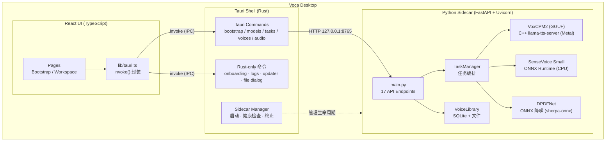
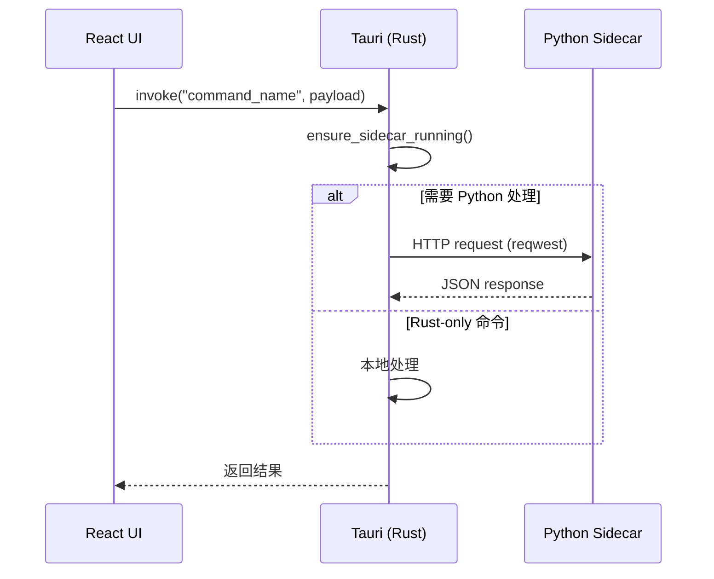
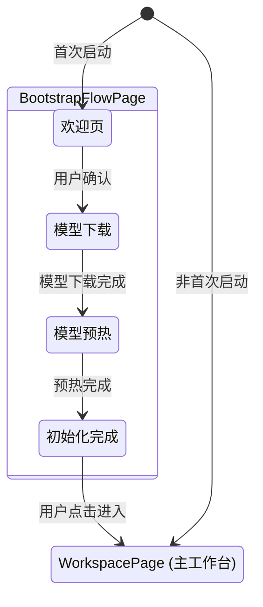
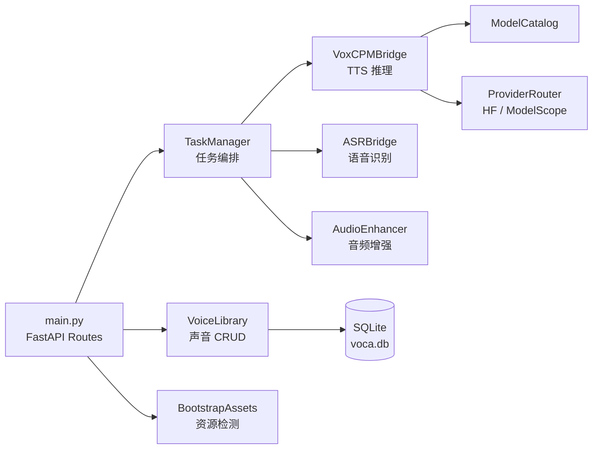
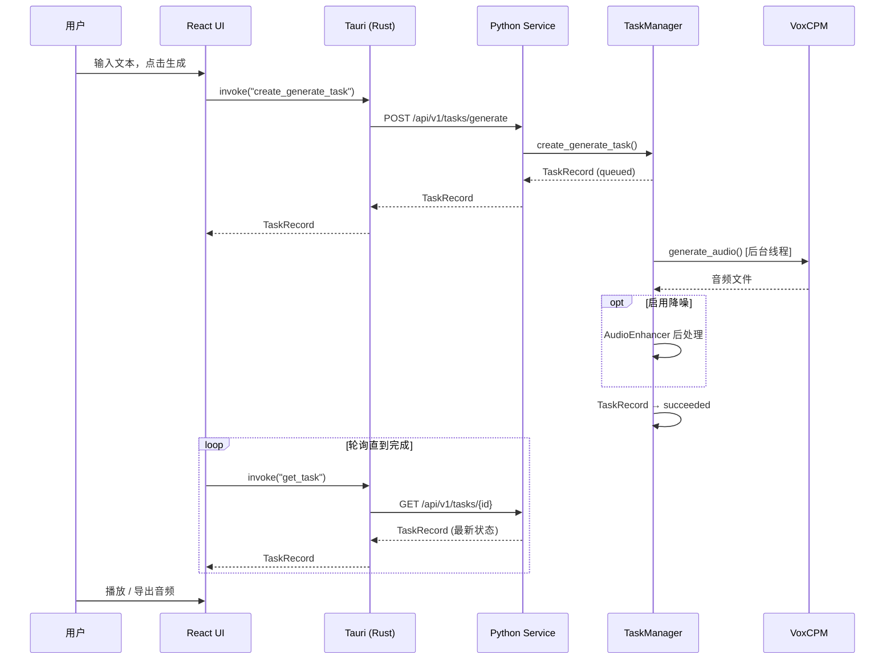
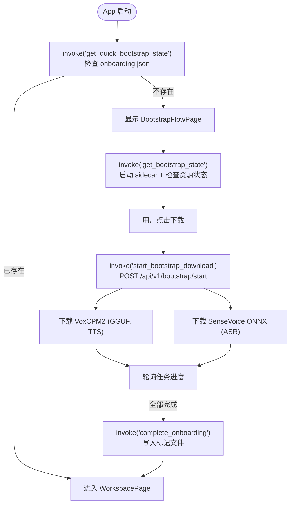
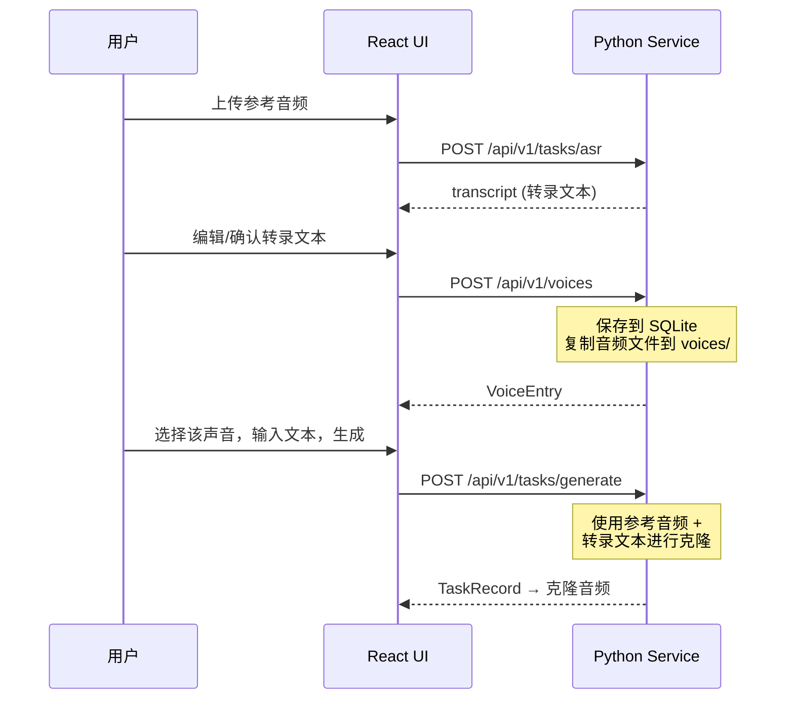

# Voca 架构概览

## 整体架构

Voca 采用三层架构：**Tauri (Rust) 桌面壳** → **React 前端** → **Python 推理 sidecar**。



## 通信流程

前端不直接与 Python 服务通信，所有请求经由 Tauri IPC 中转：



Rust 层在转发前会确保 sidecar 已启动且健康。部分命令（如完成引导、导出日志、检查更新）由 Rust 直接处理，不经过 Python。

## 目录结构

```
Voca/
├── desktop/
│   ├── app/                      # React 前端
│   │   ├── src/
│   │   │   ├── pages/            # 页面组件
│   │   │   │   ├── BootstrapFlowPage.tsx   # 首次启动引导
│   │   │   │   ├── WorkspacePage.tsx        # 主工作台
│   │   │   │   └── PreviewGalleryPage.tsx   # 开发预览
│   │   │   ├── components/       # UI 组件
│   │   │   ├── lib/
│   │   │   │   ├── tauri.ts      # Tauri invoke 封装（唯一的后端通信层）
│   │   │   │   └── historyStorage.ts  # 本地任务历史持久化
│   │   │   └── App.tsx           # 根组件，基于状态机的视图切换
│   │   └── public/               # 静态资源
│   │
│   ├── src-tauri/                # Rust 桌面壳
│   │   ├── src/
│   │   │   ├── lib.rs            # 应用入口，命令注册，退出清理
│   │   │   ├── state.rs          # AppState（sidecar 端口、进程句柄）
│   │   │   ├── sidecar.rs        # Python sidecar 生命周期管理
│   │   │   └── commands/         # Tauri 命令实现
│   │   │       ├── bootstrap.rs  # 引导流程状态与控制
│   │   │       ├── models.rs     # 模型目录、下载、校验
│   │   │       ├── tasks.rs      # 语音生成 & ASR 任务
│   │   │       ├── voices.rs     # 声音库 CRUD
│   │   │       ├── audio.rs      # 音频文件操作（选择、读取、保存）
│   │   │       └── updater.rs    # GitHub Releases 更新检查
│   │   └── tauri.conf.json       # Tauri 打包配置
│   │
│   ├── python-service/           # Python 推理服务
│   │   ├── app/
│   │   │   ├── main.py           # FastAPI 路由定义（17 个端点）
│   │   │   ├── models/
│   │   │   │   └── schemas.py    # Pydantic 请求/响应模型
│   │   │   └── services/         # 业务逻辑层
│   │   │       ├── task_manager.py       # 任务编排（生成、ASR、下载）
│   │   │       ├── voxcpm_bridge.py      # TTS 桥接（分派到 C++ 后端）
│   │   │       ├── cpp_tts_backend.py    # C++ 后端分派（server / CLI）
│   │   │       ├── voxcpm_server.py      # 常驻 TTS server 生命周期 + HTTP 客户端
│   │   │       ├── process_guard.py      # 原生子进程注册表 + 父进程守望（防孤儿）
│   │   │       ├── asr_bridge.py                 # SenseVoice ASR 桥接（入口）
│   │   │       ├── sensevoice_onnx_session.py    # 自研 ONNX Session（Fbank+LFR+CMVN+CTC）
│   │   │       ├── audio_enhancer.py     # DPDFNet 降噪（sherpa-onnx，ONNX，无 torch）
│   │   │       ├── voice_library.py      # 声音库（SQLite + 文件）
│   │   │       ├── model_catalog.py      # 模型目录管理
│   │   │       ├── bootstrap_assets.py   # 引导资源就绪检查
│   │   │       ├── provider_router.py    # 下载源路由（HF vs ModelScope）
│   │   │       └── storage_paths.py      # 存储路径规范
│   │   └── requirements.runtime.txt      # 运行时依赖
│   │
│   ├── packages/
│   │   └── contracts/            # 共享 TypeScript 类型定义
│   │       └── src/index.ts      # 前端与 Rust 的接口契约
│   │
│   └── scripts/                  # 构建辅助脚本
│
├── VoxCPM/                       # VoxCPM 语音引擎（子目录）
├── docs/                         # 文档
└── assets/                       # 仓库级资源（logo 等）
```

## 模块详解

### Tauri 桌面壳 (Rust)

负责窗口管理、系统集成和 sidecar 生命周期。

**Sidecar 管理** (`sidecar.rs`):
- 启动时检测端口 8765 是否已有服务运行
- 若无，则启动 Python uvicorn 子进程
- 健康检查：最多轮询 60 次（间隔 250ms）等待 `/api/v1/health` 就绪
- 验证 OpenAPI 兼容性（检查关键路径是否存在）
- 应用退出时终止**整棵进程树**（见下）

**进程树与退出清理**

三个进程逐层派生：Tauri 壳 → Python sidecar（打包名 `VocaService`）→ 常驻 TTS server（打包名 `voca-service`，上游 `llama-tts-server`）。

孙进程是泄漏风险点：退出时若直接 SIGKILL sidecar，它的 shutdown 钩子不会执行，TTS server 会被 launchd/init 收养并继续占用数 GB 显存。三层防护相互独立，任一层失效都不会泄漏进程：

| 层 | 位置 | 职责 |
|---|---|---|
| 优雅 + 强制终止 | `platform::terminate_child_tree`（Rust）| 先 SIGTERM 走优雅退出，2 秒宽限期后**先杀子孙再杀父进程**（父进程一死就找不到子孙）；Windows 用 `taskkill /F /T` 整树带走 |
| 孤儿清扫 | `process_guard.sweep_orphans`（Python）| 原生子进程 PID 记入 `run/native-children.json`，下次启动清理崩溃残留；杀之前按进程名核对，避免 PID 复用误杀 |
| 父进程守望 | `process_guard.start_parent_watchdog`（Python）| 经 `VOCA_PARENT_PID` 监测外壳存活，外壳崩溃/被强制退出时立即自我清理并退出 |

`src-tauri/` 下的 `cargo test` 有一条针对第一层的回归测试。

**Rust-only 命令**（不经过 Python）:
- `complete_onboarding` — 写入引导完成标记文件
- `export_logs` — 收集并导出日志
- `check_for_update` — 请求 GitHub Releases API
- `pick_audio_file` / `save_audio_as` — 系统文件对话框
- `get_setup_diagnostics` — 系统环境检测

### React 前端

基于状态机的视图切换，而非传统路由：



前端通过 `lib/tauri.ts` 中封装的 `invoke()` 调用与 Rust 层通信，不存在直接的 HTTP 请求。

### Python 推理服务

FastAPI 单文件路由 + 分层 service 模块：



**TaskManager** 是核心编排器，管理后台线程中的生成、ASR 和下载任务，维护内存中的 `TaskRecord` 列表。

## 核心数据流

### 语音生成



### 首次引导 (Bootstrap)



### 声音克隆



## 本地存储

所有用户数据存储在 `~/Library/Application Support/Voca/`:

```
Voca/
├── models/           # 下载的模型文件
├── voices/           # 用户声音库（音频 + 元数据）
├── audio/            # 生成的音频输出
├── logs/             # 服务日志（自动轮转，5 MB 上限）
├── run/              # 原生子进程注册表（native-children.json，用于孤儿清扫）
├── voca.db           # SQLite 数据库（声音库）
├── onboarding.json   # 引导完成标记
└── model_catalog.json # 运行时模型目录副本
```

