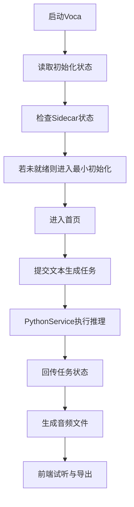

# Voca P0 PoC 实施文档

## 1. 文档定位

- 文档类型：实施文档
- 对应阶段：`P0 PoC`
- 对应产品：`Voca`
- 关联文档：
  - [docs/prd_desktop_app_zh.md](docs/prd_desktop_app_zh.md)
  - [docs/tech_solution_voca_zh.md](docs/tech_solution_voca_zh.md)
  - [docs/api_event_protocol_voca_zh.md](docs/api_event_protocol_voca_zh.md)
  - [docs/contracts_draft_voca_zh.md](docs/contracts_draft_voca_zh.md)

本文档用于定义 `Voca` 在 `P0 PoC` 阶段的实现目标、范围、产出、目录建议、开发顺序和验收标准。

## 2. P0 的目标

`P0 PoC` 的目的不是做完一个可公开交付的产品，而是验证整条桌面链路是否成立。

本阶段必须回答三个问题：

1. `Tauri` 桌面壳是否能稳定拉起并控制本地 `Python sidecar`
2. 现有 `VoxCPM` 能力是否能通过本地服务形式稳定提供给桌面端
3. 初始化、生成、结果回传这一条最小主流程是否能跑通

## 3. P0 成功标准

P0 完成时，至少要满足以下条件：

1. 本地可以启动 `Voca` 桌面壳。
2. 桌面壳可以拉起 `Python Service`。
3. 前端能检查 sidecar 健康状态。
4. 前端能提交一条文本生成任务。
5. Python Service 能调用现有 `VoxCPM` 能力完成至少一种基础生成。
6. 前端能收到任务状态变化并展示最终结果。
7. 生成后的音频文件可以试听或导出。

## 4. P0 范围

### 4.1 必做范围

- `Tauri + React` 基础桌面壳
- `Python sidecar` 启动与健康检查
- 最小初始化状态管理
- 单模型、单默认配置的基础文本生成
- 基础任务状态回传
- 基础结果展示

### 4.2 可延后范围

- 双下载源真实接入
- 基于 IP 的下载源自动推荐
- 完整日志导出
- 完整缓存清理
- 完整设置页
- 模型切换
- 参考音频克隆和 ASR

### 4.3 明确不做

- Windows 支持
- 自动更新
- 多模型管理 UI
- LoRA、训练或服务端能力
- 完整视觉设计稿还原

## 5. P0 推荐产出

P0 结束后建议产出以下内容：

- 一个可本地运行的 `Voca` 桌面 PoC
- 一条从启动到生成结果的录屏
- 一份已验证的目录结构
- 一份 sidecar 启动和调试说明
- 一份问题清单与下一阶段缺口列表

## 6. P0 验证主流程



## 7. P0 系统边界

### 7.1 前端

前端在 P0 只需要承担最小交互闭环：

- 启动页或首页
- 文本输入框
- 生成按钮
- 当前任务状态
- 音频结果区

不要求：

- 完整设计稿
- 完整多页路由
- 全量设置页

### 7.2 Tauri Core

P0 必须验证的能力：

- 启动时读取基础状态
- 拉起 Python sidecar
- 轮询或检测 sidecar 健康状态
- 向前端暴露 command
- 转发任务状态事件

P0 可以暂时弱化的能力：

- 完整下载管理器
- 完整 provider 路由
- 完整 SQLite 持久化

### 7.3 Python Service

P0 必须验证的能力：

- `health` 接口
- 基础模型校验
- 加载模型
- 发起单次生成任务
- 返回任务状态和结果路径

P0 可以暂时弱化的能力：

- 流式生成
- ASR
- 模型卸载
- 完整结构化日志导出

## 8. 建议目录结构

P0 阶段建议尽快落出最小目录组织：

```text
desktop/
  app/
    src/
      pages/
      components/
      stores/
      services/
  src-tauri/
    src/
      commands/
      events/
      sidecar/
      state/
  python-service/
    app/
      api/
      services/
      models/
      tasks/
```

### 8.1 前端目录建议

- `pages/`
  - `HomePage`
  - `BootstrapPage`
- `components/`
  - `TaskStatusCard`
  - `AudioResultCard`
- `stores/`
  - `bootstrapStore`
  - `taskStore`
- `services/`
  - `tauriClient`
  - `eventBridge`

### 8.2 Rust 目录建议

- `commands/`
  - `bootstrap.rs`
  - `tasks.rs`
  - `sidecar.rs`
- `events/`
  - `bootstrap_events.rs`
  - `task_events.rs`
- `sidecar/`
  - `process_manager.rs`
  - `healthcheck.rs`
- `state/`
  - `app_state.rs`

### 8.3 Python 目录建议

- `api/`
  - `health.py`
  - `tasks.py`
- `services/`
  - `model_loader.py`
  - `generation_service.py`
- `models/`
  - `schemas.py`
- `tasks/`
  - `task_manager.py`

## 9. P0 开发顺序

### 阶段 1：基础工程骨架

目标：

- 把三个工作区建起来

要完成的事情：

1. 建立 `desktop/app`
2. 建立 `desktop/src-tauri`
3. 建立 `desktop/python-service`
4. 确认基础启动方式
5. 确认前后端本地联调方式

验收结果：

- 三个子项目能独立启动

### 阶段 2：sidecar 启动链路

目标：

- 让 Tauri 能拉起并监控 Python Service

要完成的事情：

1. Tauri 启动 Python sidecar
2. Python Service 暴露 `GET /api/v1/health`
3. Tauri 轮询或主动检查健康状态
4. 前端展示当前服务状态

验收结果：

- 前端能看到 sidecar 是 `running` 还是 `not ready`

### 阶段 3：最小生成链路

目标：

- 打通从文本输入到音频输出的主流程

要完成的事情：

1. Python Service 封装现有 `VoxCPM` 推理
2. 暴露 `POST /api/v1/tasks/generate`
3. 暴露 `GET /api/v1/tasks/{taskId}`
4. Tauri 转发任务状态到前端
5. 前端提交生成并轮询或监听状态

验收结果：

- 输入一段文本后可以生成一段音频

### 阶段 4：最小初始化链路

目标：

- 在没有完整下载器的情况下，至少验证初始化状态机

要完成的事情：

1. 加入 `BootstrapState`
2. 实现 `get_bootstrap_state`
3. 实现 `start_bootstrap`
4. 前端渲染最小初始化页

验收结果：

- App 启动时能根据状态决定进入初始化页还是首页

### 阶段 5：结果展示与导出

目标：

- 让 PoC 不只“跑通”，而且可演示

要完成的事情：

1. 音频文件结果回传
2. 前端试听控件
3. 导出路径选择
4. 基础错误提示

验收结果：

- 生成结束后用户可以试听并保存结果

## 10. 模块拆解建议

### 10.1 前端模块

#### `bootstrapStore`

负责：

- 当前初始化阶段
- sidecar 是否就绪
- 最近错误

#### `taskStore`

负责：

- 当前任务列表
- 当前任务状态
- 当前结果引用

#### `tauriClient`

负责：

- 统一调用 Tauri commands
- 统一处理命令错误

#### `eventBridge`

负责：

- 统一订阅 Tauri events
- 将事件分发给 store

### 10.2 Rust 模块

#### `ProcessManager`

负责：

- sidecar 启动
- sidecar 关闭
- sidecar 重启

#### `HealthcheckService`

负责：

- 检查 Python Service 健康
- 返回结构化状态

#### `CommandHandlers`

负责：

- 暴露给前端的 command 接口

#### `EventEmitter`

负责：

- 将内部状态变化广播给前端

### 10.3 Python 模块

#### `GenerationService`

负责：

- 接收生成参数
- 调用现有 `VoxCPM` 逻辑
- 输出音频文件

#### `TaskManager`

负责：

- 管理任务状态
- 保存任务结果
- 提供查询接口

#### `ModelLoader`

负责：

- 模型路径校验
- 模型加载
- warmup

## 11. P0 接口最小集合

### 11.1 Tauri commands

- `get_bootstrap_state`
- `get_sidecar_status`
- `start_bootstrap`
- `create_generate_task`
- `get_task`
- `choose_export_audio_path`

### 11.2 Tauri events

- `bootstrap.progress`
- `bootstrap.failed`
- `bootstrap.ready`
- `task.updated`
- `task.succeeded`
- `task.failed`
- `sidecar.state_changed`

### 11.3 Python HTTP API

- `GET /api/v1/health`
- `POST /api/v1/models/validate`
- `POST /api/v1/models/load`
- `POST /api/v1/tasks/generate`
- `GET /api/v1/tasks/{taskId}`

### 11.4 Python SSE

- `task.status`
- `task.progress`
- `error`
- `heartbeat`

## 12. P0 数据流建议

### 12.1 启动数据流

1. 前端启动
2. 调用 `get_bootstrap_state`
3. Tauri 读取本地状态
4. Tauri 检查 sidecar 状态
5. 前端根据结果渲染页面

### 12.2 生成数据流

1. 前端提交文本
2. Tauri 转发请求到 Python Service
3. Python 创建任务
4. Python 推进任务状态
5. Tauri 转发事件给前端
6. 前端渲染结果

## 13. P0 测试建议

### 13.1 手动测试

必须至少覆盖以下场景：

1. 首次启动
2. sidecar 正常启动
3. sidecar 启动失败
4. 单次文本生成成功
5. 单次文本生成失败
6. 结果导出
7. App 重启后状态恢复

### 13.2 可后续补充的自动测试

- 前端 store 单测
- Rust command 层单测
- Python API 层单测

P0 不要求一次性补齐所有自动化测试，但至少应保留测试入口。

## 14. 风险与提前规避

### 14.1 sidecar 启动复杂

风险：

- `Tauri` 下拉起 Python 进程的细节会影响后续所有联调

应对：

- 尽早单独验证 sidecar 生命周期，不要等前端页面都搭完再做

### 14.2 模型加载过慢

风险：

- 首次加载和 warmup 很可能显著拖慢 PoC 体验

应对：

- P0 接受慢，但必须能展示明确状态

### 14.3 任务状态不同步

风险：

- 前端、Tauri、Python 三层都维护状态时容易不一致

应对：

- 先以 Python 的任务状态为准，Tauri 负责转发和少量缓存

### 14.4 范围失控

风险：

- 容易在 P0 阶段把下载器、克隆、ASR、设置页一起塞进来

应对：

- P0 严格只跑最小文本生成链路

## 15. P0 结束后应进入什么阶段

P0 验证完成后，下一步进入 `P1 MVP` 的重点应是：

1. 初始化链路做完整
2. runtime 与模型下载做完整
3. 引入双 provider 抽象
4. 增加声音设计和声音克隆
5. 增加日志导出和恢复能力

## 16. 当前结论

`Voca` 的 `P0 PoC` 最关键的不是页面做得多完整，而是先验证以下最小闭环：

- `Tauri` 能拉起 `Python sidecar`
- `Python Service` 能封装现有 `VoxCPM`
- 前端能发起任务、接收状态、拿到结果

只要这个闭环跑通，后续再往上叠初始化流程、模型下载、双 provider 和更完整的页面体验，风险就会小很多。
