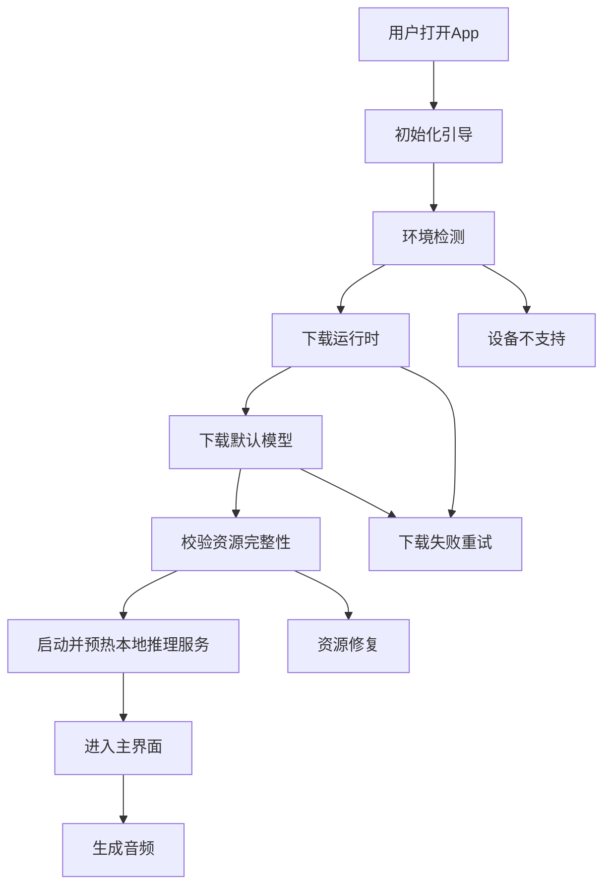
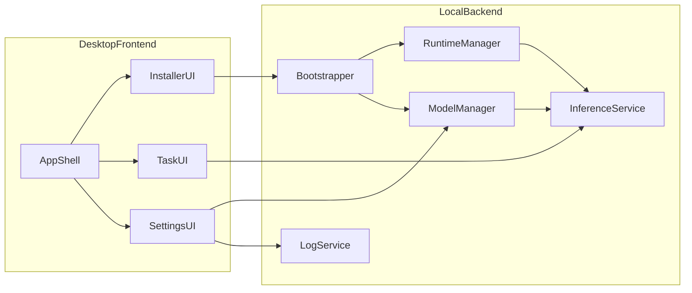

# VoxCPM App PRD

## 1. 文档概览

- 文档状态：PRD 初稿
- 产品方向：Mac 首发轻安装器，Windows 作为第二阶段路线图
- 当前能力基础：以仓库内现有的 VoxCPM 本地推理能力为落地基础，后续可扩展到更完整的 VoxCPM App 产品线
- 核心目标：让非技术用户在 Mac 上下载 `DMG` 后，无需使用终端，即可完成环境准备、模型下载并运行本地语音生成

## 2. 背景与机会

当前仓库已经提供了较完整的部署教程与本地推理能力，但对小白用户而言，实际体验仍然偏“工程化”。从 `docs/tutorial_deploy_zh.md` 可以看到，用户需要理解 Python 版本、PyTorch 与 CUDA、模型下载源、环境变量、命令行启动和端口等概念；而从 `pyproject.toml`、`app.py` 与 `src/voxcpm/core.py` 可以看到，当前推理链路还依赖重量级 Python 包、模型下载与首启 warmup。

这意味着现有方案更适合开发者，而不是普通终端用户。桌面 App 的价值，不是简单把 Web Demo 套一层壳，而是把“复杂的本地部署过程”产品化，抽象成可视化、可恢复、可诊断的一键体验。

## 3. 问题定义

### 3.1 当前小白用户的核心阻塞点

1. 不知道自己的机器是否支持运行，尤其是不理解 Apple Silicon、NVIDIA、CPU、显存和内存差异。
2. 需要手动安装 Python、虚拟环境和依赖，容易在版本或路径上出错。
3. 需要理解 PyTorch、MPS、CUDA 等概念，门槛高且报错不直观。
4. 首次启动模型需要联网下载，用户缺少清晰的下载进度、磁盘占用提示和失败重试机制。
5. 当前启动方式依赖终端与命令行参数，不符合普通用户习惯。
6. 出错时缺少面向非技术用户的指引，只能看日志或教程排查。

### 3.2 机会点

如果把环境检测、运行时安装、模型下载、服务启动、异常恢复和日志导出全部收敛到桌面应用中，VoxCPM App 能把“半小时到数小时的部署过程”收敛为“下载 App 并完成首次初始化”的产品体验，显著扩大目标用户群。

## 4. 产品定位

VoxCPM App 是一个面向普通用户的本地 AI 语音生成应用。用户通过图形界面完成模型初始化、文本输入、声音设计、参考音频克隆、结果试听与导出，不需要理解底层 Python 推理框架。

产品首发不追求覆盖所有平台和所有高级能力，而是优先验证以下命题：

- 非技术用户是否愿意为了更强的隐私和本地可控性，在本地安装和使用 AI 语音生成应用。
- 首次初始化流程是否足够顺滑，能否把复杂安装链路压缩到可接受范围。
- 本地桌面场景下，基础 TTS 与可控克隆是否能成为可重复使用的核心功能。

## 5. 目标用户

### 5.1 核心用户

- 想要快速体验高质量 TTS 的普通 Mac 用户
- 内容创作者、短视频创作者、播客或配音爱好者
- 需要离线或本地化语音生成能力的个人用户

### 5.2 次级用户

- 需要给客户或内部同事演示 VoxCPM 能力的售前、运营或产品人员
- 有轻度技术背景，但不想手动折腾环境的开发者或研究人员

### 5.3 暂不优先覆盖用户

- 需要大规模并发调用的服务端用户
- 需要 LoRA 微调、批量任务、API 集成和服务器部署的高级用户
- 需要一包覆盖所有 Windows GPU 环境的用户

## 6. 产品目标与非目标

### 6.1 产品目标

1. 提供 Mac 上“下载即用”的本地语音生成体验。
2. 让用户无需终端即可完成运行时安装、模型下载和应用启动。
3. 把复杂错误转化为可理解、可恢复的图形化提示。
4. 基于前后端分离架构，为后续 Windows 版和更多模型能力预留扩展空间。

### 6.2 非目标

1. 首发版本不覆盖所有桌面平台。
2. 首发版本不承诺支持 Intel Mac。
3. 首发版本不包含 LoRA 微调、训练、Nano-vLLM 生产部署或开放 API 服务能力。
4. 首发版本不追求离线大包分发，模型默认在线下载。
5. 首发版本不把极致克隆和 ASR 自动转写作为必须交付项。

## 7. 版本策略

| 版本 | 目标 | 平台 | 说明 |
|---|---|---|---|
| P0 概念验证 | 跑通桌面壳 + 本地 Python 后端 + 基础推理 | Apple Silicon Mac | 证明架构可行、首启可恢复 |
| P1 MVP | 对小白可交付的首次公开版本 | Apple Silicon Mac | 轻安装器、自动准备环境、基础 TTS/可控克隆 |
| P2 增强版 | 扩展高级功能与体验 | Mac + Windows 预研 | 补强日志、模型管理、更多功能与平台能力 |
| P3 Windows 正式版 | 支持分变体的 Windows 安装与运行 | Windows | 作为二期路线图单独推进 |

## 8. MVP 范围

### 8.1 必做能力

1. `DMG` 分发与 App 安装
2. 首次启动自动完成环境检测
3. 自动下载匹配的 Python 运行时与核心依赖
4. 自动下载默认模型并展示进度
5. 提供基础文本转语音能力
6. 提供声音设计能力
7. 提供参考音频可控克隆能力
8. 提供任务状态、结果试听、导出音频和日志导出
9. 提供失败重试、恢复下载和可读报错

### 8.2 可选能力

- 自定义模型目录导入
- 最近历史记录
- 下载源切换
- 简单的高级参数开关

### 8.3 不纳入 MVP

- LoRA 微调
- 批量 CLI 工作流
- Nano-vLLM 或服务端部署模式
- 多用户账户体系
- 插件系统
- 完整 ASR 驱动的极致克隆流程

## 9. 典型用户场景

### 场景 A：首次安装并生成第一段语音

1. 用户下载 `DMG` 并完成安装。
2. 首次打开 App，进入初始化引导页。
3. App 自动检测芯片架构、可用磁盘空间、网络状态和权限。
4. App 自动下载运行时与默认模型。
5. 初始化完成后进入主界面，用户输入文本并选择声音风格。
6. 用户点击生成并试听导出结果。

### 场景 B：上传参考音频进行可控克隆

1. 用户进入“克隆声音”页面。
2. 上传一段参考音频。
3. 输入目标文本和可选控制描述。
4. 点击生成，等待本地推理完成。
5. 试听并导出音频。

### 场景 C：初始化失败后的自恢复

1. 用户在下载模型或运行时过程中断网。
2. App 自动记录当前进度和校验状态。
3. 用户重新打开 App 后，系统提示继续下载或切换下载源。
4. 下载成功后自动恢复初始化流程并进入主界面。

## 10. 用户体验流程

### 10.1 首次打开时的页面阶段

1. 欢迎页：介绍产品价值与初始化耗时预期。
2. 环境检查页：展示芯片、内存、磁盘空间和网络状态。
3. 下载页：展示运行时和模型包的下载进度、速度、剩余时间。
4. 初始化页：展示解压、安装、校验、预热等步骤。
5. 完成页：引导进入主界面。

### 10.2 主界面信息架构

- 首页：快速生成、最近任务、当前模型状态
- 声音设计：文本输入、音色描述、生成结果
- 声音克隆：上传参考音频、控制描述、生成结果
- 下载与模型：查看模型状态、路径、剩余磁盘空间
- 设置：日志导出、资源清理、版本信息、实验功能开关

## 11. 前后端分离架构

### 11.1 架构原则

1. 前端负责用户交互、状态展示和流程编排。
2. 后端负责环境准备、模型管理、本地推理和日志。
3. 前后端通过本地 IPC 或本地 HTTP API 通信。
4. 后端可被独立替换或升级，不与前端 UI 强耦合。

### 11.2 架构示意

### 11.3 组件职责

| 组件 | 职责 |
|---|---|
| 前端桌面壳 | 承载窗口、页面路由、交互状态和升级提示 |
| 初始化管理器 | 执行设备检测、下载调度、安装编排、失败恢复 |
| 本地运行时管理器 | 管理 Python 运行时、依赖安装、版本升级与回滚 |
| 模型管理器 | 管理模型下载、校验、目录、删除和切换 |
| 本地推理服务 | 调用当前 Python 推理栈完成音频生成 |
| 日志服务 | 记录错误、诊断信息、导出支持包 |

## 12. 技术基线与产品假设

### 12.1 基于当前仓库的能力判断

- `app.py` 已具备本地 Web Demo 能力，说明当前仓库可以作为桌面版后端的能力基础。
- `src/voxcpm/core.py` 已具备本地路径加载与 Hugging Face 下载能力，说明模型管理可沿现有思路扩展为 GUI 流程。
- `pyproject.toml` 依赖较重，因此首发更适合采用“轻安装器 + 首启下载运行时/依赖”的模式，而不是预封装成超大安装包。
- Apple Silicon 的 MPS 可运行，但 `torch.compile` 不可用，说明 Mac 首发必须接受“可用优先于极致性能”的策略。

### 12.2 MVP 平台假设

- 首发仅支持 Apple Silicon Mac
- 建议统一内存 16GB 及以上
- 默认联网使用
- 默认下载官方推荐模型
- 不要求用户自行安装 Python、Conda 或任何命令行工具

## 13. 安装、运行时与模型策略

### 13.1 安装包策略

- 安装包形式：`DMG`
- 包体内容：桌面壳、引导器、最小必要资源
- 不在安装包内预置完整模型
- 不要求用户手动下载 Python 依赖或执行安装脚本

### 13.2 首启自动准备策略

1. 检测设备架构与最低硬件条件
2. 下载并安装与设备匹配的运行时包
3. 下载默认模型与必要资源
4. 校验文件完整性
5. 启动本地后端并完成 warmup
6. 向前端返回“可用”状态

### 13.3 模型下载策略

- 默认使用产品内置的下载配置，不暴露技术概念给用户
- UI 中展示下载大小、速度、剩余时间和目标目录
- 支持失败续传和重新校验
- 支持用户在设置页中手动导入本地模型目录

### 13.4 资源目录策略

- 运行时、模型和日志均存放在 App 私有目录
- 设置页提供空间占用查看与清理入口
- 卸载时允许用户选择是否保留模型与缓存

## 14. 功能需求明细

### 14.1 初始化模块

| 编号 | 需求 |
|---|---|
| FR-01 | App 首次启动时自动检测设备、磁盘和网络 |
| FR-02 | 支持自动下载并安装运行时 |
| FR-03 | 支持自动下载默认模型 |
| FR-04 | 支持中断恢复与失败重试 |
| FR-05 | 初始化完成后自动进入主界面 |

### 14.2 生成模块

| 编号 | 需求 |
|---|---|
| FR-06 | 支持输入文本进行本地语音生成 |
| FR-07 | 支持声音设计模式 |
| FR-08 | 支持上传参考音频并进行可控克隆 |
| FR-09 | 支持播放、暂停、重新生成和导出音频 |
| FR-10 | 支持展示任务状态和错误原因 |

### 14.3 设置与运维模块

| 编号 | 需求 |
|---|---|
| FR-11 | 支持查看当前模型与缓存占用 |
| FR-12 | 支持导出日志用于问题排查 |
| FR-13 | 支持清理缓存与重新初始化 |
| FR-14 | 支持查看版本信息与更新提示 |

## 15. 非功能需求

| 类型 | 要求 |
|---|---|
| 易用性 | 非技术用户在无终端参与的前提下完成首次初始化 |
| 可恢复性 | 下载中断、服务启动失败后可重试、可恢复 |
| 可观测性 | 应用内可查看关键步骤状态，并支持导出日志 |
| 可扩展性 | 前后端分离，便于未来替换后端实现或扩平台 |
| 稳定性 | 二次启动不重复初始化，不因短时网络波动导致不可恢复 |

## 16. 异常场景与错误恢复

| 场景 | 用户提示 | 系统动作 |
|---|---|---|
| 设备不满足最低要求 | 展示不支持原因与建议方案 | 阻止进入初始化，保留日志 |
| 磁盘空间不足 | 提示所需空间与当前剩余空间 | 暂停下载，提示清理 |
| 运行时下载失败 | 提示网络异常，可重试 | 保留断点，支持继续下载 |
| 模型下载失败 | 提示切换下载源或稍后重试 | 保存已下载分片 |
| 资源校验失败 | 提示重新校验或重新下载 | 自动标记损坏资源 |
| 推理服务启动失败 | 提示重新初始化或导出日志 | 自动收集启动日志 |
| 生成失败 | 展示可读错误，不直接暴露堆栈 | 支持重试和上报 |

## 17. 数据、隐私与日志策略

1. 默认所有推理在本地完成，不上传用户音频和文本内容。
2. 若需要下载模型或运行时，仅发起资源下载相关网络请求。
3. 日志默认只记录初始化和运行状态，不记录完整敏感内容。
4. 用户可主动导出日志包用于支持排查。
5. 若后续接入崩溃上报，必须通过显式授权。

## 18. Windows 二期路线图

### 18.1 为什么不纳入首发

Windows 环境差异主要集中在以下方面：

- NVIDIA 驱动版本与 CUDA 兼容矩阵复杂
- 不同 GPU 显存和算力差异较大
- 原生依赖和 DLL 加载问题更多
- 一个安装包难以稳定覆盖 CPU、NVIDIA、多种 CUDA 组合

因此 Windows 更适合作为“分变体、分阶段”的二期项目，而不是首发 MVP 的一部分。

### 18.2 Windows 二期建议路径

1. 先做安装器和环境检测原型，验证 CPU 版与单一 CUDA 版的可行性。
2. 将运行时包拆分为多个分发变体，而不是追求一个万能安装包。
3. 建立更完善的驱动检查、依赖修复和日志诊断体系。
4. 在 Mac MVP 跑通后，再扩展到 Windows Beta。

## 19. 成功指标

### 19.1 产品指标

- 安装完成率
- 首次初始化完成率
- 首次生成成功率
- 首次生成耗时
- 七日留存和重复生成率

### 19.2 体验指标

- 用户首次从下载到生成第一段音频的总耗时
- 初始化失败后的恢复成功率
- 用户手动求助率
- 应用崩溃率

## 20. MVP 验收标准

1. 一台全新的 Apple Silicon Mac 上，用户无需终端即可完成安装和初始化。
2. 初始化过程能清晰展示下载、安装、校验和启动状态。
3. 用户能在主界面完成至少一种基础文本转语音任务。
4. 用户能完成一次参考音频克隆并导出结果。
5. 二次打开 App 时，不重复下载和初始化已完成资源。
6. 常见失败场景都有清晰提示和恢复路径。
7. 用户能导出日志供排查使用。

## 21. 里程碑建议

| 阶段 | 目标 | 产出 |
|---|---|---|
| 阶段 1 | 完成产品方案与技术预研 | PRD、技术预研结论、PoC 范围 |
| 阶段 2 | 跑通桌面壳与本地后端通信 | 本地 PoC、初始化链路 Demo |
| 阶段 3 | 完成 MVP 主流程 | 轻安装器、自动下载、基础生成能力 |
| 阶段 4 | Beta 测试与问题修复 | 内测版本、日志体系、体验优化 |
| 阶段 5 | 对外发布 | 正式版 DMG、安装指引、版本说明 |

## 22. 落地任务拆解

### 22.1 产品与设计

- 明确用户旅程、首次启动文案与失败提示
- 设计初始化流程和主界面信息架构
- 确定哪些功能纳入 MVP，哪些进入实验区

### 22.2 前端

- 搭建 Electron 类桌面应用基础框架
- 实现初始化引导、主界面、设置页和下载进度页
- 建立任务状态、失败重试和日志导出交互

### 22.3 后端

- 抽离桌面版本地推理服务接口
- 实现运行时安装器、模型下载器、校验与恢复逻辑
- 收敛生成、克隆、缓存管理和日志采集能力

### 22.4 打包与发布

- 设计 DMG 打包与签名、公证流程
- 设计运行时包与模型包的分发方案
- 建立版本升级与回滚机制

### 22.5 测试与运维

- 建立 Apple Silicon 设备矩阵测试
- 验证断网、磁盘不足、初始化失败等场景
- 建立问题日志、支持文档和 FAQ

## 23. 主要风险

| 风险 | 描述 | 应对建议 |
|---|---|---|
| 运行时体积大 | Python 与依赖体积较大，影响首次体验 | 采用轻安装器 + 首启下载 |
| 模型下载慢 | 首次下载耗时长、网络不稳定 | 断点续传、进度提示、下载源策略 |
| Mac 性能预期差异 | MPS 可用但性能不如 CUDA | 在产品中明确首发性能边界 |
| 签名与公证复杂 | 桌面分发链路复杂 | 尽早纳入发布流程设计 |
| 功能范围失控 | 容易把 LoRA、ASR、批量任务一起纳入 | 严格限定 MVP 边界 |

## 24. 开放问题

1. `VoxCPM App` 的中英文显示名、安装包名和应用内标题是否需要完全统一。
2. 默认模型下载源应如何根据地区或网络环境做策略切换。
3. MVP 是否需要保留实验性的“高级克隆”入口。
4. 后续是否需要支持模型切换、模型商店或更多生成模式。

## 25. 结论

该项目适合按“Mac 首发、轻安装器、自动准备环境、前后端分离”的方式推进。首个版本的成功不在于覆盖所有平台和所有高级能力，而在于把当前复杂的本地部署体验收敛为面向小白用户的图形化产品流程。只要先把首次初始化、基础生成、可控克隆和错误恢复做好，这个桌面 App 就具备明确的产品价值与后续扩展空间。
