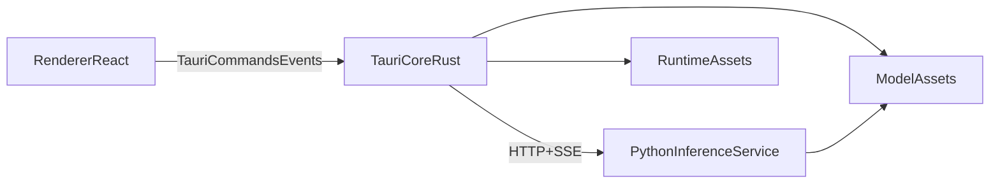

# Voca 桌面应用技术方案

## 1. 文档定位

- 文档类型：技术方案
- 对应产品：`Voca`
- 关联需求文档：[docs/prd_desktop_app_zh.md](docs/prd_desktop_app_zh.md)
- 关联协议文档：[docs/api_event_protocol_voca_zh.md](docs/api_event_protocol_voca_zh.md)
- 关联契约草案：[docs/contracts_draft_voca_zh.md](docs/contracts_draft_voca_zh.md)
- 关联 P0 文档：[docs/p0_poc_implementation_voca_zh.md](docs/p0_poc_implementation_voca_zh.md)
- 目标版本：`P0 PoC` 到 `P1 MVP`
- 首发平台：Apple Silicon Mac

本文档用于在 PRD 基础上进一步明确 `Voca` 的前后端技术方案、模块边界、运行时策略、模型下载策略与后续开发拆解方式，作为后续 PoC 和 MVP 开发的技术基线。

## 2. 命名约定

- 产品名统一为 `Voca`
- `VoxCPM` 仅指底层推理引擎、仓库能力或 Python 包名
- 对外展示、安装包、目录名、设置项和日志包均以 `Voca` 为主名

## 3. 方案目标

### 3.1 目标

1. 基于现有 `VoxCPM` 本地推理能力，快速构建一款面向小白用户的桌面应用。
2. 保证用户无需终端即可完成初始化、模型下载、语音生成和错误恢复。
3. 通过前后端分层设计，为后续 Windows 版、模型管理和更多能力扩展预留空间。

### 3.2 非目标

1. 当前阶段不重写模型推理核心。
2. 当前阶段不引入 LoRA 微调、开放 API 服务、服务端部署模式。
3. 当前阶段不锁定模型下载平台的唯一实现，而是先保留多平台抽象。

## 4. 现状与约束

### 4.1 当前仓库可复用能力

- [VoxCPM/src/voxcpm/core.py](VoxCPM/src/voxcpm/core.py) 已提供模型加载、warmup、生成和流式生成能力。
- [VoxCPM/app.py](VoxCPM/app.py) 已封装 `VoxCPMDemo`，说明当前已有可复用的参数拼装和调用流程。
- [VoxCPM/pyproject.toml](VoxCPM/pyproject.toml) 已明确依赖 `torch`、`torchaudio`、`transformers`、`modelscope`、`funasr`、`gradio` 等重量级 Python 依赖。

### 4.2 关键约束

- 桌面版不能是纯前端壳，必须保留本地 Python 推理后端。
- 由于依赖和模型体积较大，不适合把全部资产预置进安装包。
- 首发平台为 Apple Silicon Mac，应优先保证“可用、稳定、可恢复”，而不是极限性能。

## 5. 总体架构

### 5.1 分层说明

- 前端渲染层：`Tauri + React + TypeScript + Vite`
- 桌面控制层：`Tauri Core / Rust`
- 推理服务层：`Python 3.11 + FastAPI + Uvicorn`
- 本地存储层：`SQLite + App 私有目录`

### 5.2 设计原则

1. UI 与推理逻辑分离。
2. 下载、恢复、日志和进程管理统一收口在桌面控制层。
3. Python 服务只负责推理、模型校验和任务执行，不直接承担桌面壳职责。
4. 模型下载策略与具体平台解耦，避免后续被单一供应源锁死。

## 6. 前端方案

### 6.1 技术选型

- 桌面壳：`Tauri`
- 页面层：`React + TypeScript + Vite`
- 状态管理：`Zustand`
- 请求与异步状态：`TanStack Query`
- UI 方案：`Tailwind CSS + shadcn/ui`

### 6.2 前端职责

- 初始化向导页：欢迎、设备检查、下载进度、安装状态、warmup 完成态
- 主界面：首页、声音设计、声音克隆、结果试听、导出
- 设置页：模型状态、空间占用、缓存清理、日志导出、版本信息、实验开关
- 错误展示：将后端错误码映射为用户可理解的提示文案

### 6.3 前端边界

- 不直接访问模型目录、运行时目录和系统进程
- 不直接决定下载平台或下载策略
- 所有高权限能力均通过 `Tauri commands` 和 `events` 暴露

## 7. 后端方案

### 7.1 Tauri Core / Rust

`Tauri Core` 是桌面端的控制中枢，建议包含以下模块：

- `Bootstrapper`
  - 负责首次启动检测、初始化编排、状态恢复
- `RuntimeManager`
  - 负责 Python runtime bundle 的下载、解压、激活、版本检查与回滚
- `DownloadManager`
  - 负责模型与运行时下载、断点续传、校验、失败重试
- `ModelProviderRouter`
  - 负责选择下载平台并调度对应 provider
- `ProcessManager`
  - 负责 Python sidecar 拉起、健康检查、退出恢复
- `LogManager`
  - 负责日志收集、分类和导出
- `TaskStore`
  - 负责任务与初始化状态持久化

### 7.2 Python 推理服务

Python 服务建议作为本地 sidecar 进程运行，建议包含以下模块：

- `InferenceService`
  - 封装 [VoxCPM/src/voxcpm/core.py](VoxCPM/src/voxcpm/core.py) 的模型加载、warmup 和生成能力
- `ModelValidator`
  - 负责校验本地模型目录、配置文件和版本兼容性
- `AudioTaskRunner`
  - 执行 TTS、声音设计和克隆任务
- `StructuredErrorAdapter`
  - 把 Python 异常映射为结构化错误码

### 7.3 为什么推理放在 Python sidecar

- 现有推理核心本身已经是 Python 实现，复用成本最低
- [VoxCPM/app.py](VoxCPM/app.py) 已证明当前生成链路可以直接抽象为服务层接口
- 这样前端和 Rust 层都不需要理解模型细节，只关注任务、状态和结果

## 8. 通信方案

### 8.1 Renderer <-> Tauri Core

- 通信方式：`Tauri commands + events`
- 适合处理：
  - 初始化状态读取
  - 文件选择
  - 模型下载进度订阅
  - 日志导出
  - 系统信息读取

### 8.2 Tauri Core <-> Python Service

- 通信方式：`HTTP API + SSE`
- 原因：
  - 比纯 `stdio` 更容易调试
  - 便于后续替换 Python 服务实现
  - 更适合做任务查询、健康检查和流式事件推送

### 8.3 建议 API 边界

- `GET /health`
- `POST /bootstrap/validate`
- `POST /models/validate`
- `POST /tasks/generate`
- `POST /tasks/clone`
- `GET /tasks/{id}`
- `POST /logs/export`
- `GET /events`

## 9. 运行时策略

### 9.1 总体原则

- 不让用户机器在首启时执行完整 `pip install`
- 运行时采用预构建 bundle 分发
- 首启只做下载、解压、校验、激活和 warmup

### 9.2 推荐方案

1. 由 CI 预构建 `Apple Silicon + Python 3.11 + 已锁定依赖` 的 runtime bundle。
2. `Tauri Core` 在初始化阶段下载匹配 bundle。
3. 下载完成后执行完整性校验。
4. 解压到 `Voca` 的 App 私有目录。
5. 使用该 runtime 拉起 Python sidecar。

### 9.3 本地目录建议

- `~/Library/Application Support/Voca/runtime`
- `~/Library/Application Support/Voca/models`
- `~/Library/Application Support/Voca/cache`
- `~/Library/Application Support/Voca/logs`
- `~/Library/Application Support/Voca/exports`

## 10. 模型下载方案

### 10.1 当前现状

目前仓库中的模型下载主要依赖 `huggingface_hub.snapshot_download()`，例如：

- [VoxCPM/src/voxcpm/core.py](VoxCPM/src/voxcpm/core.py)
- [VoxCPM/app.py](VoxCPM/app.py)

这个方案适合 `Hugging Face`，但不足以支撑 `HF + 魔搭社区` 双平台的产品要求，因此桌面版需要在此基础上做抽象升级。

### 10.2 总体目标

1. 同时支持 `Hugging Face` 和 `魔搭社区`
2. 支持默认下载源自动推荐
3. 支持用户手动切换下载源
4. 支持失败后切换重试
5. 支持统一的 manifest、文件校验和恢复流程

### 10.3 下载源抽象

建议在 `Tauri Core` 中设计统一 provider 抽象：

- `HuggingFaceProvider`
- `ModelScopeProvider`

统一接口建议包含：

- `resolve_model()`
- `list_files()`
- `download_file()`
- `resume_download()`
- `verify_checksum()`
- `get_display_name()`
- `get_error_hint()`

这样后续即使替换 SDK 或改为自建分发层，也不会影响前端和 Python 服务。

### 10.4 基于 IP 的动态选择机制

建议把“基于 IP 的默认路由”明确写入方案，但暂不锁定具体实现方式。

默认规则建议如下：

- 中国大陆网络环境：优先 `魔搭社区`
- 其他区域：优先 `Hugging Face`

注意事项：

- 该策略只是默认推荐，不是强制绑定
- 用户必须可以在设置页手动切换下载源
- 下载失败时应允许自动建议切换
- VPN、代理、企业网络可能导致误判，因此不能把 IP 判断作为唯一决策依据

### 10.5 Manifest 设计建议

建议引入统一模型清单，例如：

- `modelKey`
- `version`
- `displayName`
- `providers`
- `files`
- `checksums`
- `recommendedRegions`
- `defaultProvider`

其中 `providers` 应分别声明：

- `Hugging Face` 仓库信息
- `魔搭社区` 仓库信息
- 文件路径或下载入口
- 平台可见名称和错误提示

### 10.6 前后端边界

- 前端只负责展示：
  - 推荐下载源
  - 当前下载源
  - 下载进度
  - 错误提示
  - 切换入口
- `Tauri Core` 负责：
  - 下载源选择
  - provider 调度
  - 下载恢复
  - 校验
  - 失败重试
- Python 服务只负责：
  - 校验本地模型目录是否可加载
  - 使用本地模型目录完成推理

## 11. 数据与状态持久化

建议使用 `SQLite` 保存以下内容：

- 初始化状态
- 下载任务状态
- 下载检查点
- 生成任务记录
- 模型版本信息
- 用户设置项
- 错误事件摘要

大文件本体不进入数据库，音频、模型和日志文件仅保存路径与元信息。

## 12. 开发目录建议

- `VoxCPM/`
  - 保留现有 Python 能力源
- `desktop/app/`
  - React 页面、状态管理、前端交互
- `desktop/src-tauri/`
  - Rust core、commands、events、下载与 sidecar 管理
- `desktop/python-service/`
  - FastAPI 服务封装 VoxCPM 能力
- `desktop/packages/contracts/`
  - 共享请求、响应、任务状态和错误码定义

## 13. 推荐实施顺序

### 阶段 1：P0 PoC

1. 建立 `Tauri + React` 基础壳层
2. 拉起 Python sidecar
3. 打通一次本地文本生成
4. 验证基础事件回传与结果导出

### 阶段 2：初始化链路

1. 设备检查
2. runtime bundle 下载与解压
3. 模型下载与校验
4. warmup
5. 恢复机制与错误提示

### 阶段 3：MVP 主流程

1. 快速生成
2. 声音设计
3. 参考音频克隆
4. 试听与导出
5. 设置页与日志导出

### 阶段 4：下载源增强

1. 引入 manifest
2. 接入双 provider
3. 增加基于 IP 的默认路由
4. 增加手动切换与失败回退

## 14. 风险与注意事项

- `torch`、`modelscope`、`funasr` 依赖较重，必须优先验证 runtime bundle 体积和下载耗时
- Apple Silicon 上性能应以“稳定可用”为先
- `Tauri` 更轻，但 sidecar、文件系统和安装链路更多落在 Rust 层，需要明确团队职责
- 基于 IP 的下载源判断存在误判风险，必须允许用户手动覆盖
- 若后续同时支持更多模型版本，manifest 和缓存清理策略要尽早设计

## 15. 最终结论

`Voca` 当前最合适的技术路线是：

- 桌面壳：`Tauri`
- 前端：`React + TypeScript + Vite`
- 桌面控制层：`Rust`
- 推理后端：`Python 3.11 + FastAPI`
- 模型下载：`HF + 魔搭双源 + 统一 provider 抽象 + 基于 IP 的默认路由 + 用户手动覆盖`

这套方案既能最大化复用现有 `VoxCPM` 仓库能力，又能满足 PRD 中对小白体验、前后端分层、初始化可恢复和模型下载灵活性的要求。
