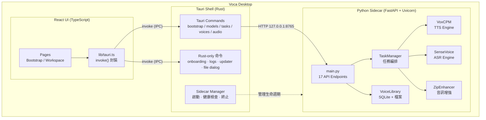
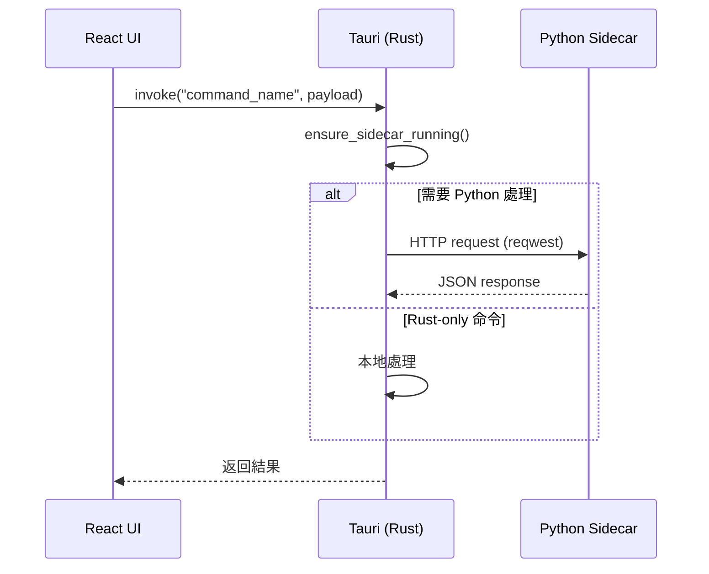
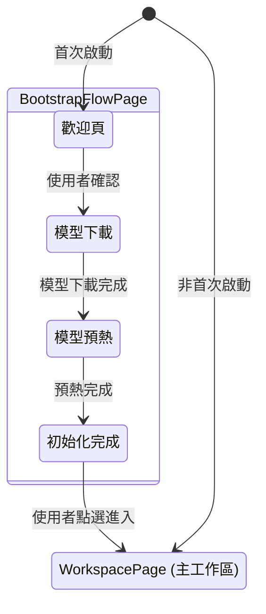
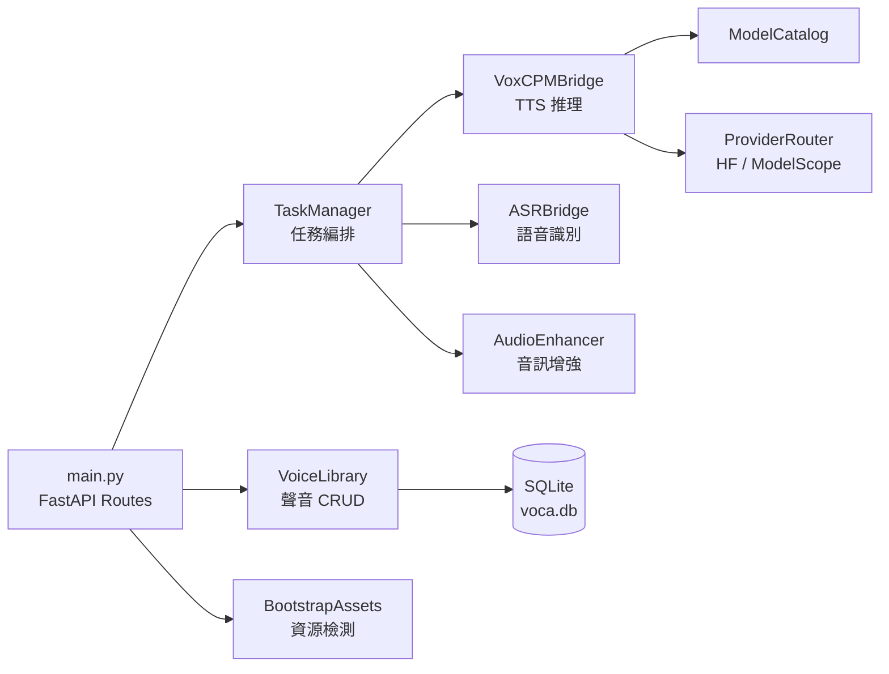
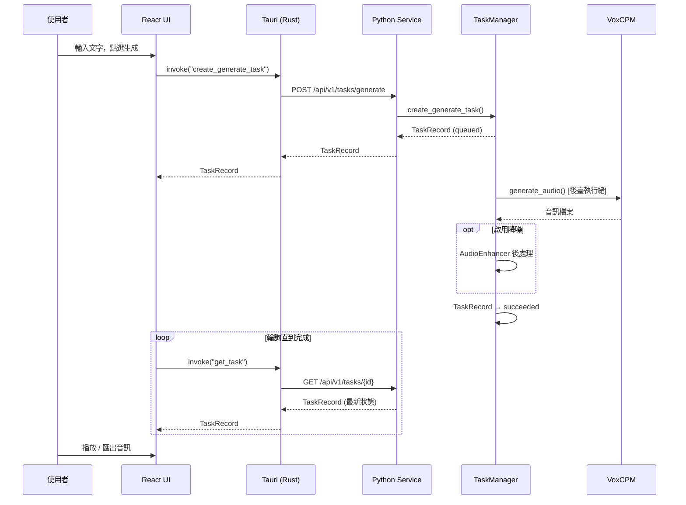
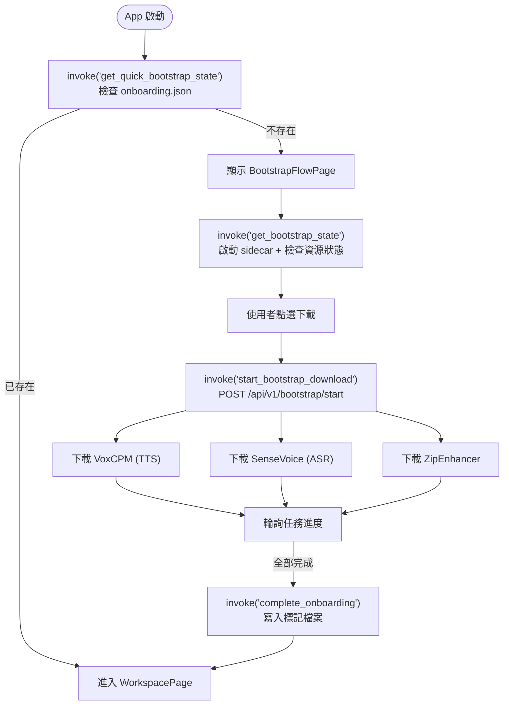
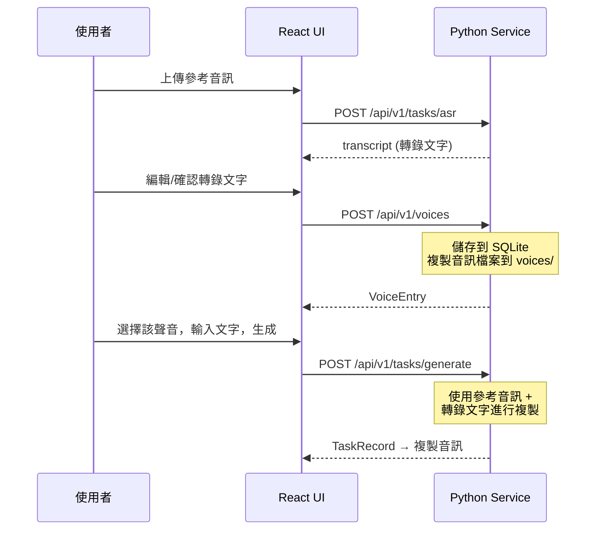

# Voca 架構概覽

## 整體架構

Voca 採用三層架構：**Tauri (Rust) 桌面殼** → **React 前端** → **Python 推理 sidecar**。



## 通訊流程

前端不直接與 Python 服務通訊，所有請求經由 Tauri IPC 中轉：



Rust 層在轉發前會確保 sidecar 已啟動且健康。部分命令（如完成引導、匯出日誌、檢查更新）由 Rust 直接處理，不經過 Python。

## 目錄結構

```
Voca/
├── desktop/
│   ├── app/                      # React 前端
│   │   ├── src/
│   │   │   ├── pages/            # 頁面元件
│   │   │   │   ├── BootstrapFlowPage.tsx   # 首次啟動引導
│   │   │   │   ├── WorkspacePage.tsx        # 主工作區
│   │   │   │   └── PreviewGalleryPage.tsx   # 開發預覽
│   │   │   ├── components/       # UI 元件
│   │   │   ├── lib/
│   │   │   │   ├── tauri.ts      # Tauri invoke 封裝（唯一的後端通訊層）
│   │   │   │   └── historyStorage.ts  # 本地任務歷史持久化
│   │   │   └── App.tsx           # 根元件，基於狀態機的檢視切換
│   │   └── public/               # 靜態資源
│   │
│   ├── src-tauri/                # Rust 桌面殼
│   │   ├── src/
│   │   │   ├── lib.rs            # 應用入口，命令註冊，退出清理
│   │   │   ├── state.rs          # AppState（sidecar 埠、程序控制代碼）
│   │   │   ├── sidecar.rs        # Python sidecar 生命週期管理
│   │   │   └── commands/         # Tauri 命令實現
│   │   │       ├── bootstrap.rs  # 引導流程狀態與控制
│   │   │       ├── models.rs     # 模型目錄、下載、驗證
│   │   │       ├── tasks.rs      # 語音生成 & ASR 任務
│   │   │       ├── voices.rs     # 聲音庫 CRUD
│   │   │       ├── audio.rs      # 音訊檔案操作（選擇、讀取、儲存）
│   │   │       └── updater.rs    # GitHub Releases 更新檢查
│   │   └── tauri.conf.json       # Tauri 打包配置
│   │
│   ├── python-service/           # Python 推理服務
│   │   ├── app/
│   │   │   ├── main.py           # FastAPI 路由定義（17 個端點）
│   │   │   ├── models/
│   │   │   │   └── schemas.py    # Pydantic 請求/響應模型
│   │   │   └── services/         # 業務邏輯層
│   │   │       ├── task_manager.py       # 任務編排（生成、ASR、下載）
│   │   │       ├── voxcpm_bridge.py      # VoxCPM TTS 引擎橋接
│   │   │       ├── asr_bridge.py         # SenseVoice ASR 橋接
│   │   │       ├── audio_enhancer.py     # ZipEnhancer 音訊增強
│   │   │       ├── voice_library.py      # 聲音庫（SQLite + 檔案）
│   │   │       ├── model_catalog.py      # 模型目錄管理
│   │   │       ├── bootstrap_assets.py   # 引導資源就緒檢查
│   │   │       ├── provider_router.py    # 下載源路由（HF vs ModelScope）
│   │   │       └── storage_paths.py      # 儲存路徑規範
│   │   └── requirements.runtime.txt      # 執行時依賴
│   │
│   ├── packages/
│   │   └── contracts/            # 共享 TypeScript 類型定義
│   │       └── src/index.ts      # 前端與 Rust 的介面契約
│   │
│   └── scripts/                  # 構建輔助指令碼
│
├── VoxCPM/                       # VoxCPM 語音引擎（子目錄）
├── docs/                         # 文件
└── assets/                       # 倉庫級資源（logo 等）
```

## 模組詳解

### Tauri 桌面殼 (Rust)

負責視窗管理、系統整合和 sidecar 生命週期。

**Sidecar 管理** (`sidecar.rs`):
- 啟動時檢測埠 8765 是否已有服務執行
- 若無，則啟動 Python uvicorn 子程序
- 健康檢查：最多輪詢 20 次（間隔 250ms）等待 `/api/v1/health` 就緒
- 驗證 OpenAPI 相容性（檢查關鍵路徑是否存在）
- 應用退出時自動終止子程序

**Rust-only 命令**（不經過 Python）:
- `complete_onboarding` — 寫入引導完成標記檔案
- `export_logs` — 收集並匯出日誌
- `check_for_update` — 請求 GitHub Releases API
- `pick_audio_file` / `save_audio_as` — 系統檔案對話方塊
- `get_setup_diagnostics` — 系統環境檢測

### React 前端

基於狀態機的檢視切換，而非傳統路由：



前端透過 `lib/tauri.ts` 中封裝的 `invoke()` 呼叫與 Rust 層通訊，不存在直接的 HTTP 請求。

### Python 推理服務

FastAPI 單檔案路由 + 分層 service 模組：



**TaskManager** 是核心編排器，管理後臺執行緒中的生成、ASR 和下載任務，維護記憶體中的 `TaskRecord` 列表。

## 核心資料流

### 語音生成



### 首次引導 (Bootstrap)



### 聲音複製



## 本地儲存

所有使用者資料儲存在 `~/Library/Application Support/Voca/`:

```
Voca/
├── models/           # 下載的模型檔案
├── voices/           # 使用者聲音庫（音訊 + 後設資料）
├── audio/            # 生成的音訊輸出
├── logs/             # 服務日誌（自動輪轉，5 MB 上限）
├── voca.db           # SQLite 資料庫（聲音庫）
├── onboarding.json   # 引導完成標記
└── model_catalog.json # 執行時模型目錄副本
```
